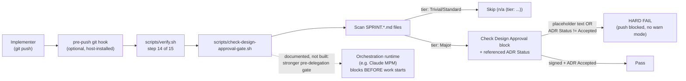

# ADR.260720.01: Design Approval git pre-push hook gate

**Status:** Accepted
**Date:** 2026-07-20
**Deciders:** Wael Rabadi (maintainer) + Principal Engineer persona

> **Approval mechanics:** `status` is the mechanical gate between architect mode and implementer mode for Major-tier changes. Implementer mode REJECTS the work if `status` is not `Accepted`. Pair this status with a signed Design Approval line in the active sprint file (see `create-sprint`). Both signals are required.

---

## Context

Major-tier work requires a "mechanical Design Approval" — an ADR at `status: Accepted` plus a signed Design Approval line in the sprint file — before implementer mode may proceed. Until this decision, that gate was entirely agent-attested: nothing mechanically stopped a push if either signal was missing or still template placeholder text. The plugin's own doctrine says it "composes with an orchestration runtime such as Claude MPM" for real enforcement, but that composition was asserted in prose, never demonstrated, and Claude MPM is not installed in this environment. Building an untested integration against it would repeat the exact "asserted, never shown" failure this decision exists to fix — the plugin's stated Problem is precisely the gap between "looks like discipline happened" and "discipline happened."

---

## Decision

**We will build `scripts/check-design-approval-gate.sh`, a hard-fail git pre-push gate that mechanically verifies the Design Approval signal for Major-tier sprints, with no warn mode and no opt-out.**

The script scans the repo for `SPRINT.*.md` files, skips Trivial/Standard-tier sprints (identified by `n/a (tier: ...)`), and for Major-tier sprints hard-fails if the Design Approval block still contains template placeholders or if the referenced ADR's `**Status:**` line is not exactly `Accepted`. It is wired into the host-repo `verify.sh` template (`skills/provision-project-overlay/templates/scripts/verify.sh.tmpl`, step 14 of 15) and therefore into the optional pre-push git hook. Unlike every other probe in this repo, it has no warn mode and no opt-out config — deliberately hard-fail, since its entire purpose is demonstrating genuine fail-closed enforcement of a gate that was previously only self-attested. Separately, we document (but do not build or test) how the same script generalizes to an orchestration-runtime pre-delegation gate — a stronger enforcement point than blocking only at push time, since it would stop an agent from ever starting Major-tier work rather than only blocking the push.

---

## Rationale

| Criterion | How This Decision Satisfies It |
| --- | --- |
| Fixes the actual gap, not a proxy | The gap was "self-attested approval," and the fix is a script that reads the artifacts and fails closed on exactly the two conditions (placeholder text, non-`Accepted` status) that constitute a fake approval. |
| Honest about what is and isn't built | The MPM pre-delegation composition remains documented, not built or tested, because MPM is not installed here — avoids repeating the "asserted, never shown" failure this decision is meant to close. |
| No quiet escape hatch | No warn mode, no config flag, no per-repo opt-out — the one thing this gate cannot become is another heuristic a team leaves permanently in advisory mode. |
| Testable today | Self-tested against 5 concrete scenarios (below) without any external runtime dependency. |

---

## Architecture Snapshot (as of this decision)

<!-- The shape this decision commits to, frozen at decision time. This is a
     point-in-time snapshot, NOT the living architecture. Current-state topology
     lives in the capability record (docs/architecture/enforcement/). -->

Resilience posture committed by this decision (only if the decision sets one):

| Boundary call | Timeout | Retry | Fallback / degraded behavior |
| --- | --- | --- | --- |
| `check-design-approval-gate.sh` invocation from `verify.sh` | None (local filesystem scan, no network) | None — deterministic re-run | None by design: a failing gate blocks the push outright; there is no degraded-pass path, since the entire point is fail-closed enforcement. |

---

## Alternatives Considered

| Option | Pros | Cons | Why Not Chosen |
| --- | --- | --- | --- |
| **A git pre-push hook script requiring no external runtime, hard-fail by design, with a documented (not built) note on composing with an orchestration runtime later (Chosen)** | Testable today; harness-agnostic; honest about what is and isn't built; closes the exact self-attestation gap. | Only covers the push-time boundary, not pre-delegation (an agent can still start Major work before pushing). | Selected — the strongest gate buildable and verifiable in this environment right now. |
| **Build and test a real Claude MPM integration** | Would demonstrate the stronger pre-delegation gate directly. | MPM isn't installed here; an integration nobody can run end-to-end is exactly the unverified-claim problem this decision is meant to close, not a fix for it. | Rejected — would trade one unverified claim for another. |
| **Make the new script warn-first with a `mode: enforce` config flag, matching every other probe's pattern in this repo** | Consistent with the rest of the plugin's promotion-ladder pattern (warn → enforce). | The entire point is to demonstrate one gate that is *actually* enforced today, not another heuristic a team can quietly leave in warn mode forever; a warn-first "enforcement demonstration" proves nothing. | Rejected — undermines the decision's own stated purpose. |

---

## Consequences

### Positive

- One concrete, self-tested, demonstrably fail-closed gate exists where none did before — self-tested against 5 scenarios: signed + ADR Accepted, unsigned/placeholder, non-Accepted ADR, correctly-skipped Standard tier, and no-sprints-clean.
- The README's enforcement-honesty section can now cite a real example of hard enforcement instead of only a caveat about self-attestation.

### Negative

- Only one gate (Design Approval) is covered — the "captured verify output in the PR" gate remains agent-attested.
- A bare harness still has no enforcement unless the host project actually installs the pre-push hook (`bootstrap.generate_pre_commit_hook` is opt-in); this gate protects nothing until that opt-in is exercised.

### Risks & Mitigations

| Risk | Likelihood | Mitigation |
| --- | --- | --- |
| A project doesn't install the git hook, or bypasses it with `--no-verify` | Medium | Documented only, not forced — the gate's protection is real but conditional on hook installation; this is named honestly rather than overstated. |
| Script has a false-negative on an unusual sprint-file naming or ADR-status formatting variant | Low | Covered by the 5-scenario self-test suite; any new failure mode discovered should extend that suite, not weaken the hard-fail behavior. |

---

## Implementation Notes

- Script: `scripts/check-design-approval-gate.sh`.
- Wired at step 14 of 15 in `skills/provision-project-overlay/templates/scripts/verify.sh.tmpl` (`step_design_approval()`, `run_step design-approval step_design_approval`).
- No `.{name}.json` config file exists for this probe, by design — there is nothing to configure.
- The orchestration-runtime pre-delegation composition (stopping an agent before it starts Major-tier work, not just before it pushes) is documented as a future-stronger enforcement point but explicitly not built or tested in this environment.

---

## Related Documents

- **Capability record (living architecture this decision shapes):** `docs/architecture/enforcement/README.md`
- **System overview:** `docs/architecture/README.md`
- **Supersedes / Superseded by:** none
- **Course-correction plan that triggered this decision:** `docs/plans/praxis-course-correction-2026-07.md`
