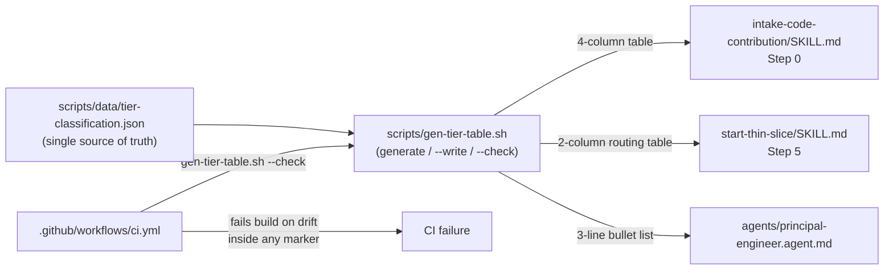

# ADR.260720.02: Single-source-of-truth generated tier-classification table

**Status:** Accepted
**Date:** 2026-07-20
**Deciders:** Wael Rabadi (maintainer) + Principal Engineer persona

> **Approval mechanics:** `status` is the mechanical gate between architect mode and implementer mode for Major-tier changes. Implementer mode REJECTS the work if `status` is not `Accepted`. Pair this status with a signed Design Approval line in the active sprint file (see `create-sprint`). Both signals are required.

---

## Context

The Trivial/Standard/Major tier-classification facts (criteria, required steps, routing path) were hand-restated in three places in three different formats: `intake-code-contribution/SKILL.md` Step 0 (the authoritative 4-column table), `start-thin-slice/SKILL.md` Step 5 (a 2-column routing table), and `agents/principal-engineer.agent.md` (a terse 3-line bullet list). A pre-existing terminology-drift lint (`.praxis-canon.json`) can only catch literal forbidden strings reappearing — it cannot catch two surfaces describing the same fact correctly but *differently* until one is edited and the others silently stop matching. This exact failure shape had already caused a real bug earlier in the plugin's history: a Major-tier workflow that could never terminate because the phase ordering was inconsistently restated across files.

---

## Decision

**We will create `scripts/data/tier-classification.json` as the single source of truth for the tier facts, and `scripts/gen-tier-table.sh` to render it into the three per-surface formats each of the three documents actually needs.**

`gen-tier-table.sh` mirrors the existing `scripts/gen-coverage-matrix.sh` generate/`--write`/`--check` pattern. Each rendered block is wrapped in `<!-- BEGIN GENERATED -->` / `<!-- END GENERATED -->` markers so only the markers' content is ever regenerated — the surrounding hand-authored prose in each file is untouched. `.github/workflows/ci.yml` runs `--check` so a hand-edit inside any marker fails CI. This is an explicit pilot on one fact, proven before any decision to generalize it to other duplicated doctrine (e.g. the Major-path phase ordering, the enforcement-kind taxonomy).

---

## Rationale

| Criterion | How This Decision Satisfies It |
| --- | --- |
| Root-causes the actual failure shape | The failure isn't "a typo slipped through" (which a string lint catches) — it's "the same fact, correctly stated twice, drifted apart." A single generated source structurally prevents that class of drift regardless of how careful an editor is. |
| Fits each surface instead of forcing uniformity | The generator renders three different formats from one JSON source, matching each document's actual verbosity needs (authoritative 4-column table vs. terse 3-line bullet list) instead of forcing one format everywhere. |
| CI-enforced, not review-dependent | `.github/workflows/ci.yml` runs `--check`; a hand-edit inside a marker fails the build immediately rather than relying on a reviewer noticing three-way divergence. |
| Proven before generalized | Scoped as a pilot on exactly one fact, validated by both a deliberate tamper test and an accidental real corruption, both caught and repaired mechanically — evidence-gated before extending the pattern elsewhere. |

---

## Architecture Snapshot (as of this decision)

<!-- The shape this decision commits to, frozen at decision time. This is a
     point-in-time snapshot, NOT the living architecture. Current-state topology
     lives in the capability record (docs/architecture/skills/). -->

Resilience posture committed by this decision: none — this is a build-time doc-generation/drift-check tool, not a runtime call path. No timeout/retry/fallback table applies.

---

## Alternatives Considered

| Option | Pros | Cons | Why Not Chosen |
| --- | --- | --- | --- |
| **One JSON source, three surface-specific render functions in one generator, marker-wrapped output, CI `--check` (Chosen)** | Structurally prevents the exact drift failure that already caused a real bug; each surface keeps its own fit-for-purpose format; proven by both a deliberate tamper test and an accidental real corruption, both caught and repaired mechanically. | Any new tier fact requires updating the JSON schema and all three render functions, not just one file. | Selected — the only option that removes the failure mode structurally rather than relying on vigilance. |
| **Leave the three surfaces as independently hand-maintained prose, relying on code review to catch drift** | No tooling to build or maintain. | This is the exact failure mode that already caused a real bug (the Major-path deadlock); review-based catching is precisely what wasn't sufficient before. | Rejected — proven insufficient by prior incident. |
| **Force all three surfaces into one identical, maximally-verbose format** (e.g. make `principal-engineer.agent.md` carry the full 4-column table) | Simplest possible generator (one render function, not three). | Each surface's format fits its context — a terse persona-mode reminder doesn't need the same verbosity as the authoritative intake gate; forcing uniformity reduces fit and readability for no drift-safety gain over per-surface rendering. | Rejected — uniformity was not a real requirement, only a simplification that would degrade every surface but the one already most verbose. |

---

## Consequences

### Positive

- The tier facts can now never silently diverge across the three surfaces; CI fails loudly and immediately if they do.
- The repair path is mechanical (`--write`), not manual reconciliation — confirmed by both a deliberate tamper test and an accidental corruption during the maintainer's own verification pass, both caught immediately by `--check` and repaired via `--write`.
- A minor, honest side-effect surfaced during the pilot: wrapping the pre-existing hand-authored `intake-code-contribution` table exposed that its column padding had already drifted (inconsistent whitespace-only alignment across rows); the generator now enforces true-max-width padding as the only principled, regenerable rule.

### Negative

- Any future tier fact needing a new field requires updating the JSON schema and all three render functions, not just one file.
- This generator pattern only covers three specific surfaces — it does not solve doctrine duplication generally; other duplicated facts (e.g. Major-path phase ordering) remain unprotected until a separate decision extends the pattern.

### Risks & Mitigations

| Risk | Likelihood | Mitigation |
| --- | --- | --- |
| A future editor hand-edits inside a `BEGIN/END GENERATED` marker, unaware it's generated | Low | `.github/workflows/ci.yml` `--check` fails the build immediately; repair is `--write`, not manual reconciliation. |
| The pilot's scope creeps into "generalize to everything" before it's proven | Low | Explicitly scoped as a one-fact pilot in this ADR; generalizing to other duplicated doctrine is a separate future decision, not implied by this one. |

---

## Implementation Notes

- Source of truth: `scripts/data/tier-classification.json`.
- Generator: `scripts/gen-tier-table.sh` (`generate` / `--write` / `--check`), mirroring `scripts/gen-coverage-matrix.sh`.
- CI wiring: `.github/workflows/ci.yml` runs `--check`.
- Rendered surfaces: `skills/intake-code-contribution/SKILL.md` Step 0, `skills/start-thin-slice/SKILL.md` Step 5, `agents/principal-engineer.agent.md`.
- Validated by two independent real-world tests: a deliberate tamper test by the implementing agent, and an accidental corruption during the maintainer's own verification pass — both caught immediately by `--check` and repaired via `--write`, not a manual patch.

---

## Related Documents

- **Capability record (living architecture this decision shapes):** `docs/architecture/skills/README.md`
- **System overview:** `docs/architecture/README.md`
- **Supersedes / Superseded by:** none
- **Course-correction plan that triggered this decision:** `docs/plans/praxis-course-correction-2026-07.md`
- **Related ADR:** `ADR.260720.03` (fidelity review and trust receipt) — same `skills` capability, same course-correction pass
