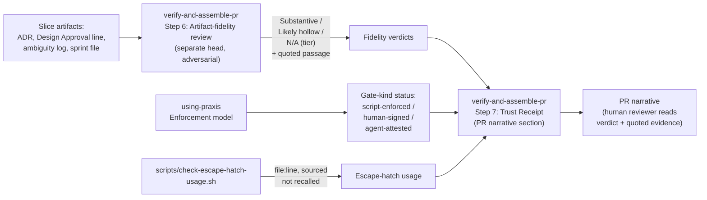

# ADR.260720.03: Artifact-fidelity review and the Trust Receipt

**Status:** Accepted
**Date:** 2026-07-20
**Deciders:** Wael Rabadi (maintainer) + Principal Engineer persona

> **Approval mechanics:** `status` is the mechanical gate between architect mode and implementer mode for Major-tier changes. Implementer mode REJECTS the work if `status` is not `Accepted`. Pair this status with a signed Design Approval line in the active sprint file (see `create-sprint`). Both signals are required.

---

## Context

Every existing `check-*.sh` probe verifies shape and presence — a field exists, a pattern matches, a count is right — but none can tell whether an ADR's alternatives are real and distinct, whether a Design Approval signature reflects genuine consideration, or whether an ambiguity log names real unknowns versus defaulting to "none" out of habit. The plugin's own stated problem (trust transfer: making the gap between "looks like discipline happened" and "discipline happened" visible) was not actually closed by shape-checking alone — a boilerplate ADR, a rubber-stamped approval, and a habitual "none found" all pass every existing probe. Separately, the trust story (which gates were genuinely engaged vs. self-attested, which escape hatches were used) was scattered across a dozen artifacts a human reviewer had to assemble by hand.

---

## Decision

**We will add Step 6 "Artifact-fidelity review" to `verify-and-assemble-pr/SKILL.md`, and pair it with a new Step 7 "Trust Receipt" section in the PR narrative template.**

Step 6 is a rubric run by a separate head (mirroring Step 5's adversarial-review discipline) that reads each artifact the slice actually produced and renders one of **Substantive / Likely hollow / N/A (tier)**, with the specific passage quoted as evidence. It explicitly does not certify decision *correctness* — only reasoning substance — and is a warn-signal, not a hard block, since hollowness can be flagged but never proven. Step 7's Trust Receipt aggregates three sourced facts into one human-readable block: gate-kind status (script-enforced / human-signed / agent-attested, per `using-praxis`'s Enforcement model), escape-hatch usage (file:line, sourced from the new `scripts/check-escape-hatch-usage.sh`, never recalled from memory), and Step 6's verdicts.

---

## Rationale

| Criterion | How This Decision Satisfies It |
| --- | --- |
| Closes the gap shape-checking cannot | Bash probes verify presence and pattern match; substance judgment (real alternative vs. straw-man, genuine signature vs. rubber stamp) requires a reader, which is exactly what an LLM reviewer — a tool new to this specific problem — can do and a regex cannot. |
| Makes the trust story visible in one place | Before this decision, gate-kind status, escape-hatch usage, and fidelity verdicts were scattered across a dozen artifacts a human had to assemble by hand; the Trust Receipt aggregates all three into one sourced block. |
| Honest about its own limits | Explicitly a warn-signal, not a hard gate — the rubric cannot certify correctness, only flag likely hollowness, and is named as gameable in its own Consequences rather than oversold. |
| Escape-hatch facts are sourced, not recalled | The Trust Receipt's escape-hatch line comes from `scripts/check-escape-hatch-usage.sh` (file:line), not from the reviewing agent's memory of the session — removing one class of confident-but-wrong self-report. |

---

## Architecture Snapshot (as of this decision)

<!-- The shape this decision commits to, frozen at decision time. This is a
     point-in-time snapshot, NOT the living architecture. Current-state topology
     lives in the capability record (docs/architecture/skills/). -->

Resilience posture committed by this decision: none — this is an authoring-time/review-time doctrine addition, not a runtime call path. No timeout/retry/fallback table applies. Step 6 is explicitly a warn-signal (never a hard automated gate), which is the closest analogue to a "degraded behavior" this decision defines: on a "Likely hollow" verdict, the PR is not blocked — the human reviewer sees the flagged passage and exercises judgment.

---

## Alternatives Considered

| Option | Pros | Cons | Why Not Chosen |
| --- | --- | --- | --- |
| **An LLM-run adversarial fidelity rubric (a different head reading for substance) plus a single aggregated, script-sourced visibility artifact (the Trust Receipt) (Chosen)** | Buildable today with the tool actually new to this problem (an LLM reviewer); makes the trust story visible in one place instead of scattered across a dozen artifacts. | Costs tokens and reviewer time on every Major/Standard slice; gameable by a sufficiently careless or adversarial agent producing text that merely looks substantive. | Selected — the only approach that can judge substance at all, paired with honest limits (warn-signal, not certification). |
| **Add more shape-checking bash probes** (e.g. a minimum-character-count check on the Alternatives Considered table) | Cheap, fast, fully mechanical, consistent with the rest of the plugin's probe pattern. | Length and keyword presence are trivially gameable and don't distinguish real reasoning from padded boilerplate; the actual judgment required ("is this a real alternative or a straw-man") is exactly what a bash regex cannot do. | Rejected — solves the wrong layer of the problem; would produce a false sense of coverage. |
| **Require a second human to manually re-review every artifact before merge** | Genuine human judgment, no LLM-gaming risk. | Does not scale, and until that human review actually happens the artifact is still purely agent-attested; this doesn't change the default state, only adds an optional manual step nobody is forced to take. | Rejected — doesn't change the default (still self-attested unless the optional step is exercised), and doesn't scale to the plugin's stated volume. |

---

## Consequences

### Positive

- A plugin built *for* LLM agents now ships the one review mechanism bash never could — substance judgment — where previously every existing probe passed a boilerplate ADR, a rubber-stamped approval, and a habitual "none found" equally.
- The Trust Receipt is the first concrete artifact directly answering the plugin's own stated problem statement (trust transfer) rather than asserting it is addressed.

### Negative

- The fidelity review costs tokens and reviewer time on every Major/Standard slice.
- It can be gamed by a sufficiently careless or adversarial agent producing text that merely *looks* substantive.
- It does not — and cannot — certify that a decision was the *right* one, only that the reasoning shown has real substance.

### Risks & Mitigations

| Risk | Likelihood | Mitigation |
| --- | --- | --- |
| Goodhart's law: "pass the fidelity review" becomes the optimized target instead of "reason well" | Medium | Kept explicitly a warn-signal for human judgment, never a hard automated gate; the human reviewer reads the quoted evidence, not just the verdict label. |
| A careless or adversarial agent produces text that reads as substantive but isn't | Medium | The rubric requires a quoted passage as evidence for every verdict, forcing the reviewing head to point at something specific rather than assert a label; residual risk accepted and named rather than hidden. |
| Escape-hatch or gate-status facts drift from what `check-escape-hatch-usage.sh` / the Enforcement model actually report | Low | Trust Receipt sources both facts mechanically (file:line from the script; gate-kind from documented Enforcement model categories) rather than from the reviewing agent's memory. |

---

## Implementation Notes

- Step 6 added to `skills/verify-and-assemble-pr/SKILL.md`: "Artifact-fidelity review," run by a separate head, same adversarial discipline as Step 5.
- Step 7 added to the PR narrative template in `skills/verify-and-assemble-pr/SKILL.md`: "Trust Receipt," aggregating gate-kind status, escape-hatch usage, and Step 6's verdicts.
- New script: `scripts/check-escape-hatch-usage.sh` — sources escape-hatch usage (file:line) mechanically for the Trust Receipt.
- Verdict vocabulary is fixed: **Substantive / Likely hollow / N/A (tier)** — each verdict requires a quoted passage as evidence.

---

## Related Documents

- **Capability record (living architecture this decision shapes):** `docs/architecture/skills/README.md`
- **System overview:** `docs/architecture/README.md`
- **Supersedes / Superseded by:** none
- **Course-correction plan that triggered this decision:** `docs/plans/praxis-course-correction-2026-07.md`
- **Related ADR:** `ADR.260720.02` (generated tier table) — same `skills` capability, same course-correction pass
