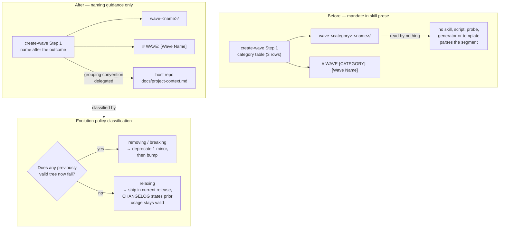

# ADR.260724: Wave naming imposes no category taxonomy — and rule relaxation is not rule removal

**Status:** Accepted
**Date:** 2026-07-24
**Accepted:** 2026-07-25 by Wael Rabadi (maintainer)
**Deciders:** Wael Rabadi (maintainer) + Principal Engineer persona

> **Approval mechanics:** `status` is the mechanical gate between architect mode and implementer mode for Major-tier changes. Implementer mode REJECTS the work if `status` is not `Accepted`. Pair this status with a signed Design Approval line in the active sprint file (see `create-sprint`). Both signals are required.

---

## Context

`skills/create-wave/SKILL.md` Step 1 mandated a three-value category taxonomy — `wave-feature-*` (user-facing capability), `wave-platform-*` (infrastructure), `wave-ext-*` (optional add-on) — and embedded it in two further places: the Step 2 folder pattern `<wave-root>/wave-<category>-<name>/` and the README title template `# WAVE-[CATEGORY]: [Wave Name]`.

A wave is the plugin's **unit of intent** — a coherent slice of product value delivered through a coordinated set of thin-slices. The taxonomy took that intent and required it to be sorted into a product-org bucket before it could be expressed at all. Two problems follow.

**It fails the plugin's own fourth scope-litmus question.** `0.4.0` added the question "Does it measurably improve the agent's execution fidelity, or close a known agent failure mode?" A rule can be universal, disciplined, and defensible and still not belong in the plugin if it fails that question. Nothing in Praxis reads the category segment: a read-only sweep at sprint creation, re-confirmed during this decision, found **seven references, all seven confined to `skills/create-wave/SKILL.md`** — the Step 1 table (×3 rows), the examples line, the project-conventions prose mention, the Step 2 folder pattern, and the README title template. No other skill, agent, instruction, script, probe, generator, or template parses or depends on it. In particular `start-thin-slice` routing and `close-sprint` reconciliation do not read it, so no fidelity signal derives from the taxonomy and no gate is weakened by removing it.

**It was load-bearing in the wrong direction.** Praxis has authored zero waves against itself. The category mandate was the first thing a wave author had to satisfy before writing down what the product was becoming — an opinionation tax charged at the exact moment the method wants intent captured. The maintainer ruled the taxonomy unnecessary opinionation, and maturing `create-wave` is the precondition for Praxis authoring its first real wave.

A second, governance-level question is inseparable from the first. `docs/project-context.md` § *Removing or breaking a rule* requires documenting a deprecation in `CHANGELOG.md` one minor version before removal, then bumping on actual removal. Read literally at `v0.5.0`, that clause would deprecate the taxonomy now and remove it in `0.6.0` — stalling the wave-authoring goal a full release cycle, or forcing Praxis to author its first wave under the naming it is mid-way through deleting and rename it later. The second option is precisely the artifact theater the method rejects.

But that clause exists to protect adopters from breakage, and **this change breaks nothing**. Widening what counts as a valid wave name invalidates no wave already authored: an existing `wave-feature-home-shell` folder remains valid, unchanged, forever. The policy has a genuine gap — it speaks to *removing* and *breaking*, and is silent on *relaxing*. Deciding this case without closing that gap guarantees the question recurs on the next relaxation.

---

## Decision

**We will remove the wave category taxonomy from `create-wave` entirely, and amend the evolution policy to classify rule *relaxation* as a third case governed by neither the deprecation clause nor the removal clause.**

Part one — the skill:

- Step 1 is retitled "Name the Wave." The category table and its examples are deleted. Waves are named `wave-<name>` after the product outcome they deliver.
- The Step 2 folder pattern becomes `<wave-root>/wave-<name>/`.
- The README title template becomes `# WAVE: [Wave Name]`.
- Grouping conventions are explicitly delegated to the host project: if a project wants to sort waves by feature/platform/extension, by team, or by release train, it records that in its own `docs/project-context.md`. This skill does not enforce it, and waves named without one are valid.

Part two — the policy:

`docs/project-context.md` § *Removing or breaking a rule* gains a **relaxing a rule** case. A relaxation widens the set of valid inputs, structures, or usages without invalidating anything previously valid. It requires neither a one-minor-version deprecation notice nor a removal bump. It ships as an ordinary change in the release it lands in, and its `CHANGELOG.md` entry must state explicitly that prior usage remains valid — so the absence of a migration step is a recorded claim a reader can check, not an omission.

The distinguishing test is adopter breakage, not diff shape: if any tree that validated before the change fails after it, the change is a removal or a break and the existing clauses apply in full.

---

## Rationale

| Criterion | How This Decision Satisfies It |
| --- | --- |
| Root-causes the actual defect | The taxonomy's problem is not that it is wrong but that it is unenforced opinionation — mandated in prose, read by nothing. Deleting it removes the tax without weakening any gate, evidenced by the seven-reference sweep. |
| Applies the plugin's own litmus to the plugin | Scope-litmus question 4 was added in `0.4.0` explicitly to catch rules that are defensible but do not improve execution fidelity. The category mandate is the first shipped rule tested against it and found wanting; not applying it to Praxis's own surface would make the question decorative. |
| Decides the governance question rather than working around it | The deprecation clause could have been quietly ignored on the grounds that "nothing breaks." Codifying relaxation as a named case converts a one-off judgment into a durable rule and leaves the reasoning auditable. |
| Preserves adopter trust by keeping the test objective | "Does any previously valid tree now fail?" is checkable. It does not let a genuinely breaking change be relabelled a relaxation to skip the deprecation cycle. |
| Unblocks the method rather than the reverse | The mandate stood between Praxis and its first authored wave. Removing it converts a governance blocker into ordinary work, which is the whole purpose of the maturation. |

---

## Architecture Snapshot (as of this decision)

<!-- The shape this decision commits to, frozen at decision time. This is a
     point-in-time snapshot, NOT the living architecture. Current-state topology
     lives in the capability record (docs/architecture/skills/). -->

Resilience posture committed by this decision: none. This changes skill prose and a governance clause. It adds no runtime boundary, no external call, and no request path, so no timeout/retry/fallback table applies.

---

## Alternatives Considered

| Option | Pros | Cons | Why Not Chosen |
| --- | --- | --- | --- |
| **Remove the mandate now as a relaxation, and codify the relaxation carve-out in the evolution policy (Chosen)** | Unblocks wave authoring in the release that needs it; adopters migrate once, since `0.5.0` is already a structural-reorganization release; the sweep proves zero blast radius; the policy gap is closed rather than stepped over, so the next relaxation does not re-litigate it. | Amends governance in the same change that benefits from the amendment, which requires the reasoning to be unusually explicit to avoid reading as self-serving. | Selected — the only option that both unblocks the goal and leaves the governance rule stronger than it found it. |
| **Follow the deprecation clause literally: deprecate the taxonomy in `0.5.0`, remove it in `0.6.0`** | Maximum fidelity to the letter of the existing policy; no governance amendment needed; zero risk of the carve-out being misused later. | Stalls TS-002 and the first authored wave a full release cycle, or forces the first wave to be authored under the naming being deleted and renamed afterward; splits adopter migration across two releases instead of one; applies an adopter-protection clause where there is no adopter to protect. | Rejected — it pays the full cost of a deprecation cycle to protect against a breakage that provably cannot occur, and the artifact it would produce in the interim (a wave named under a deprecated convention) is exactly the theater the method rejects. |
| **Demote the taxonomy to optional guidance, keeping the table in the skill as a suggested convention** | Smallest possible change; no rule leaves the plugin, so the deprecation question never arises; projects wanting a taxonomy get a ready-made one. | Leaves the opinionation in the skill that was judged unnecessary, merely unenforced; a suggested table in an opinionated plugin reads as a default and will be followed as one; keeps a fact in `create-wave` that belongs in the host project's own context. | Rejected — it resolves the enforcement question while preserving the opinionation, which is the actual thing being removed. The pivot branch of the sprint's hypothesis card reserves this as the fallback if category-free wave folders turn out to collide or become unsortable in practice. |

---

## Consequences

### Positive

- Wave authoring no longer requires a taxonomy decision before intent can be written down, which is what unblocks Praxis authoring its first wave against itself.
- The plugin's fourth scope-litmus question has now been applied to a shipped Praxis rule and removed it. The question is demonstrably load-bearing rather than aspirational.
- The evolution policy can classify a change class it previously could not, with an objective test (`does any previously valid tree now fail?`) rather than case-by-case argument.
- Adopters of `0.5.0` absorb this alongside the release's existing structural reorganization — one migration, not two.

### Negative

- The evolution policy is amended by the same change that benefits from the amendment. That is disclosed here rather than hidden, but a reviewer is entitled to weigh it, and the decision should not be read as precedent for amending governance whenever it obstructs.
- Projects that wanted a category convention now have to define one themselves. Praxis supplies no default, so early adopters lose a small amount of scaffolding.
- The relaxation carve-out is a new judgment surface. "Widens what is valid" is objective at the edges and arguable in the middle — a change that relaxes one constraint while tightening an adjacent one needs the stricter classification, and nothing mechanical enforces that reading.

### Risks & Mitigations

| Risk | Likelihood | Mitigation |
| --- | --- | --- |
| A future genuinely-breaking change is relabelled a "relaxation" to skip the deprecation cycle | Medium | The policy amendment states the test as adopter breakage, not diff shape: if any previously valid tree fails after the change, the removal clauses apply in full. The CHANGELOG entry must assert that prior usage stays valid, making the claim explicit and falsifiable by a reviewer. |
| Category-free wave folders become ambiguous, collide, or prove unsortable at scale | Low | The sprint's hypothesis card names this as the pivot branch: the response is an *optional documented convention* in the host project's context, not restoration of the mandate. Alternative 3 above is the pre-agreed fallback shape. |
| An adopter with existing `wave-feature-*` folders reads the CHANGELOG as requiring a rename | Medium | Both the skill's Step 1 text and the CHANGELOG entry state explicitly that existing wave folders remain valid, category prefix and all. |
| The seven-reference sweep missed a dependency in a surface not searched | Low | The sweep covered `skills/`, `agents/`, `instructions/`, `scripts/`, and templates for all five reference spellings, and was re-run after the edit returning zero hits outside the sprint record. `validate-plugin.sh` cross-reference and inventory-parity checks pass, which would catch a dangling internal reference. |

---

## Implementation Notes

- Skill edits (applied): `skills/create-wave/SKILL.md` — project-conventions bullet, Step 1 (retitled, table and examples replaced with naming guidance plus the explicit no-taxonomy paragraph), Step 2 folder pattern, README title template.
- `CHANGELOG.md` (applied): a `### Changed` bullet under `[0.5.0]` recording the removal, the scope-litmus-4 rationale, and the relaxation-not-removal argument with sweep evidence; and an amendment to `0.5.0`'s *Note on the version number*, which previously claimed no rule was removed and would otherwise have become false.
- `docs/project-context.md` § *Removing or breaking a rule* (**outstanding**): add the relaxing-a-rule case. Until this lands, the CHANGELOG argues a carve-out the policy does not contain.
- `.version-bump.json` `audit.allow` (applied): authoring this ADR made `validate-plugin.sh` check #13 fail — the version single-source gate had no concept of an immutable historical record, so the release-context references above (`0.4.0 added the question`, `0.5.0 is already a structural reorganization`) read as undeclared version claims. `docs/architecture/adr` is now declared, same class as the existing `docs/plans` allowance and scoped to the `adr/` directory only, so the living capability records stay guarded. The gate finding is itself evidence for the CI slice: this class of defect is invisible until the gates actually run.
- Verification: `scripts/validate-plugin.sh` passes 13/13 after the skill and CHANGELOG edits. Post-edit sweep for `wave-feature`, `wave-platform`, `wave-ext`, `WAVE-[CATEGORY]`, and `wave-<category>` returns hits only in the sprint file and its ledger, which record the pre-change state by design and are not rewritten.
- Evidenced on 2026-07-25: `create-wave` was run end-to-end and produced `docs/product/waves/wave-self-conformance/`, whose folder name carries no category segment and whose README title is `# WAVE: Self-Conformance`. That was the outstanding proof this decision needed, since a category-free wave cannot be demonstrated by reading the skill alone.

### Provenance and recorded deviations

Kept here because an ADR is an immutable historical record, and the wave documents this decision unblocked are required to carry intent only, never history:

- **The wave came after its own first four slices.** `TS-001`–`TS-004` of `wave-self-conformance` were defined in the sprint that carried this work before any wave existed, because removing the category mandate was itself the precondition for authoring one. They were back-filled into the wave as their upstream source. This is the bootstrapping case, not a licence to define slices outside a wave generally.
- **Implementation preceded this ADR reaching `Accepted`.** The sprint plan made an Accepted ADR a hard precondition for the removal. The maintainer directed the edit before that, was told at the time that it preceded the gate, and the design-approval gate correctly reported the sprint un-verifiable until the ADR was accepted and the approval block signed on 2026-07-25. The gate held; the ordering was a knowing exception.
- **Three slices were reclassified inward.** `TS-005`–`TS-007` were originally deferred as a separate later batch and were ruled part of the same course correction. They were routed to the wave rather than added to the in-flight sprint, holding sprint scope immutable while letting wave scope grow — which is the division of responsibility the two artifacts exist to provide.

---

## Related Documents

- **Capability record (living architecture this decision shapes):** `docs/architecture/skills/README.md`
- **System overview:** `docs/architecture/README.md`
- **Governance clause amended:** `docs/project-context.md` § *Evolution policy* → *Removing or breaking a rule*
- **Active sprint (TS-001):** `docs/product/sprints/SPRINT.260724-praxis-self-conformance.md`
- **Supersedes / Superseded by:** none
- **Related ADR:** `ADR.260720.01` (Design Approval git hook gate) — the gate this ADR's `status` must satisfy for the Major-tier sprint carrying TS-001
