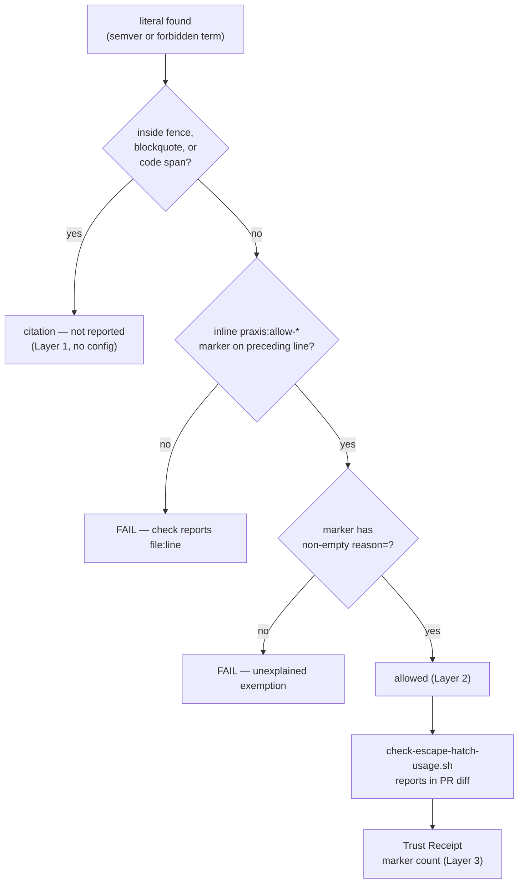

# ADR.260725: Declared exceptions move inline — citation is not assertion

**Status:** Accepted
**Date:** 2026-07-25
**Accepted:** 2026-07-25 by Wael Rabadi (maintainer)
**Deciders:** Wael Rabadi (maintainer) + Principal Engineer persona

> **Approval mechanics:** `status` is the mechanical gate between architect mode and implementer mode for Major-tier changes. Implementer mode REJECTS the work if `status` is not `Accepted`. Pair this status with a signed Design Approval line in the active sprint file (see `create-sprint`). Both signals are required.

---

## Context

Two of the plugin's self-checks are literal scanners. Check #13 (version single-source, delegating to `bump-version.sh --audit`) fails on any semver literal outside the mechanically-synced manifests. Check #10 (terminology) fails on any `.praxis-canon.json` `forbiddenTerms` match. Both encode a real defect: a document that *asserts* a stale plugin version, or *uses* retired doctrine vocabulary, misleads a reader.

Neither can distinguish a document that **asserts** a literal from one that **cites** it. An ADR writing "0.4.0 added the fourth litmus question" is recording history. A sprint ledger recording that it injected a retired doctrine term and confirmed the check fired is recording a test. Both are correct prose that the scanners read as defects.

**This ADR is its own evidence.** The sentence above originally quoted the retired term verbatim, and check #10 failed the build on it — the document proposing the fix could not state its own motivating example. The options available today were to reword (chosen, at a cost in precision) or to exempt the entire `docs/architecture/adr/` tree a second time. Layer 1 below would permit the quotation inside a code span with no configuration at all.

The existing mechanism is a path allowlist, and the self-conformance sprint produced hard evidence that it does not hold:

- **`.version-bump.json` `audit.allow` holds 9 entries. Only 2 are line-scoped; 7 disable the check for an entire file or directory.**
- **`.praxis-canon.json` `terminologyAllowPaths` holds 4 entries and has no `reason` field** — it is a bare string array, so the same concept is modeled twice, in two files, at two levels of rigor, and the weaker of the two produces unexplained exemptions.
- Both new entries were added **within the same working session**: `docs/architecture/adr` when authoring `ADR.260724` tripped check #13, then `docs/product/sprints` when recording that sprint's terminology negative test tripped check #10. Two instances an hour apart is a pattern, not an incident.

Three failures follow from the shape:

1. **Coarse granularity inverts default-deny.** `docs/architecture/adr` exempts every ADR permanently. A future ADR that develops a genuine stale claim about the *current* version now passes silently — precisely the defect check #13 exists to catch, disabled for the tree holding the plugin's most durable decisions.
2. **The reason is remote from the occurrence.** A reader of `ADR.260724` sees `0.4.0` in prose with no local signal that it is sanctioned; the justification sits in a JSON file they have no reason to open.
3. **Growth is silent.** Nine entries, no mechanism that surfaces their accumulation and nothing that ever prompts removal.

Two facts make a better design available rather than merely desirable. First, **check #14 (link resolution), added in the same sprint, already solved this exact problem structurally** — it distinguishes citation from assertion by position, skipping fenced blocks because template content resolves relative to the destination document. Second, **Praxis already owns an inline opt-out idiom**: `check-escape-hatch-usage.sh` scans four `praxis:allow-*` markers, diff-scoped and informational, on the stated principle that "using an opt-out is never silent to a PR reviewer." Its header explicitly instructs that adding a fifth marker requires updating the list — extension is anticipated design, not a workaround.

---

## Decision

**We will replace path-based allowlists with declared exceptions in three layers, preserving default-deny at line granularity.**

**Layer 1 — structural citation detection, no configuration.** A literal inside a fenced code block, a blockquote, or an inline code span is a citation, not an assertion, and is not reported. This reuses check #14's existing rule rather than inventing one, and its fence tracking must honour the opening marker's length — a naive three-backtick toggle produced a false negative during the sprint that motivated this ADR.

**Layer 2 — inline markers for the prose residue.** A citation in running prose is an assertion by position and cannot be detected structurally. It carries a marker with a mandatory reason, scoped to the following line:

```markdown
<!-- praxis:allow-version-literal reason="release context of this decision, not a current-version claim" -->
```

Two new markers join the existing four: `praxis:allow-version-literal` and `praxis:allow-term`. A marker without a non-empty `reason=` is itself a failure — an unexplained exemption is the defect this ADR is removing.

**Layer 3 — accumulation is visible.** Both new markers are registered with `check-escape-hatch-usage.sh` so each use appears in the PR diff report, and the marker count joins the Trust Receipt defined by `ADR.260720.03`. An allowlist that grows in silence is debt; one that reports its size every PR is a decision the reviewer keeps making.

The path allowlists are then retired **completely**. An earlier draft of this decision preserved a whole-path exemption for a genuinely frozen tree, on the strength of `docs/plans` being a pre-adoption archive nobody would edit again. That directory has since been removed — its open commitment migrated into the wave that owns it — so the exception has zero instances. A rule with no instance is speculative generality, which this plugin rejects elsewhere and should reject here. If a genuinely frozen tree appears later, reintroducing the exception is a small, evidence-backed change; inventing it now is not.

**Migration is gated.** The scanners gain a `--report-only` mode that emits what *would* fail under the new rules while the old allowlists remain authoritative. The path lists are deleted only once that pass shows parity — no entry silently becoming permissive, no burst of false failures.

---

## Rationale

| Criterion | How This Decision Satisfies It |
| --- | --- |
| Preserves default-deny where the current design abandons it | Exemption drops from directory scope to one line. An ADR citing release history stays exempt on that line while a genuine stale-version claim three paragraphs later still fails — impossible under a path entry. |
| Reuses two mechanisms already in the repo | Layer 1 is check #14's rule; Layer 2 is `check-escape-hatch-usage.sh`'s marker idiom, whose own header anticipates extension. No new concept is introduced, so there is one way to declare an exception rather than three. |
| Puts the justification where the reader is | The reason travels with the text it excuses. A reviewer reading the diff sees both the literal and why it is allowed, without opening a config file. |
| Makes the cost of exemptions felt | Diff-scoped reporting plus a Trust Receipt count converts silent monotonic growth into a visible, recurring decision — the same trust-transfer logic `ADR.260720.03` applies to artifact fidelity. |
| Fixes the modelling asymmetry | One mechanism replaces `audit.allow` (reasoned, mostly path-wide) and `terminologyAllowPaths` (unreasoned, entirely path-wide), which express the same idea at different rigor. |
| Migrates without a trust gap | `--report-only` proves parity before the old lists are deleted, so the release-critical `bump-version.sh --audit` path is never left in an unverified state. |

---

## Architecture Snapshot (as of this decision)

<!-- The shape this decision commits to, frozen at decision time. This is a
     point-in-time snapshot, NOT the living architecture. Current-state topology
     lives in the capability record (docs/architecture/enforcement/). -->



Resilience posture committed by this decision: none. These are build-time linters with no runtime boundary, external call, or request path, so no timeout/retry/fallback table applies.

---

## Alternatives Considered

| Option | Pros | Cons | Why Not Chosen |
| --- | --- | --- | --- |
| **Three-layer declared exceptions: structural detection, inline reasoned markers, visible accumulation (Chosen)** | Restores default-deny at line granularity; reason travels with the text; reuses check #14's rule and the existing marker idiom rather than adding a concept; unifies two inconsistent configs; growth becomes a recurring visible decision. | Touches two scanners including the release-critical `--audit` path; markers add invisible-but-noisy clutter to prose source; migration of 13 entries carries regression risk. | Selected — the only option that fixes the granularity inversion, which is the actual defect. The `--report-only` gate contains the migration risk. |
| **Keep path allowlists; add a `reason` field to `terminologyAllowPaths`** | Very small change; removes the unexplained-exemption problem immediately; zero risk to `bump-version.sh`. | Leaves the real defect untouched — 7 of 9 entries still disable checks directory-wide, so a genuine stale claim in any ADR still passes silently. Growth stays silent. Two configs still model one concept. | Rejected — it fixes the least important of the three failures and would be mistaken for having addressed the others. Worth doing *inside* this decision, not instead of it. |
| **Structural detection only (Layer 1), no markers** | No new marker vocabulary; zero config; simplest possible rule. | Insufficient — the two cases that triggered this ADR are both prose citations outside any fence or quote. Would force authors to contort historical prose into blockquotes to satisfy a linter, which degrades the writing to serve the tool. | Rejected — does not cover the motivating cases, and its failure mode is bad prose. |
| **Exclude documentation trees from both checks entirely** | Trivially simple; no false positives ever; no migration. | Abandons real coverage: check #13 caught three live drifts (`project-context.md` claiming `v0.4.0`, `architecture/README.md` claiming `0.3.0` two releases behind, and `ADR.260724`), all in documentation. Doc trees are exactly where stale version claims live. | Rejected — would delete the only evidence these checks have that they work. |

---

## Consequences

### Positive

- A stale current-version claim in an ADR or sprint file becomes catchable again, which it is not today.
- One exception mechanism replaces three shapes (`audit.allow` with `lines`, `audit.allow` path-wide, bare `terminologyAllowPaths`).
- Exemptions become self-documenting at the point of use, and their total becomes a number a reviewer sees per PR.
- The plugin gains a second worked example of extending its own escape-hatch idiom, testing whether that idiom generalizes — useful evidence independent of this ADR's subject.

### Negative

- Prose source gains HTML-comment markers. They render invisibly but read noisily, and a document with several becomes harder to edit.
- `bump-version.sh --audit` is load-bearing for the release process; a regression there breaks version bumps, not merely linting. The blast radius is larger than the defect being fixed.
- Layer 1 opens a real coverage hole: doctrine drift written inside a blockquote escapes the terminology gate. Small, but it is a genuine loss, not a neutral trade.
- Six markers is a vocabulary an author must know. The fifth and sixth are the point at which "four known markers" stops being memorable.

### Risks & Mitigations

| Risk | Likelihood | Mitigation |
| --- | --- | --- |
| Migration silently makes an entry more permissive, dropping real coverage | Medium | `--report-only` parity pass is a hard precondition for deleting the path lists; diff the two rule sets' output on the clean tree and require an exact match modulo intended changes. |
| A regression in `bump-version.sh --audit` breaks a release bump | Low | Change `--audit`'s matching only; leave `--check`/`--write` paths untouched. Self-test against the existing fixtures before and after. |
| Markers become a reflex — authors add one instead of fixing a real stale claim | Medium | Mandatory non-empty `reason=`, diff-scoped reporting, and the Trust Receipt count. The fidelity review in `verify-and-assemble-pr` Step 6 already grades whether a stated reason carries substance; marker reasons fall under it. |
| Layer 1's fence tracking repeats check #14's false-negative bug | Low | Share one implementation with check #14 rather than writing a second fence parser; the sprint that produced this ADR documented the exact failure (naive toggle vs. marker-length-aware). |
| Six markers accrete to ten as new checks arrive | Medium | `check-escape-hatch-usage.sh`'s header already requires updating a single authoritative list; adding a marker without registering it should fail the enforcement-scripts check. |

---

## Implementation Notes

- Scanners to change: `scripts/bump-version.sh` (`--audit` matching only) and `scripts/validate-plugin.sh` check #10 (terminology).
- Fence/quote/code-span detection: extract check #14's implementation into a shared helper rather than duplicating it — the two must not diverge.
- Markers to register in `scripts/check-escape-hatch-usage.sh` and its header list: `praxis:allow-version-literal`, `praxis:allow-term`.
- Trust Receipt: extend `skills/verify-and-assemble-pr/SKILL.md` Step 7 with the marker count.
- Configs to retire: `.version-bump.json` `audit.allow` and `.praxis-canon.json` `terminologyAllowPaths`, in full. Both shed their `docs/plans` entry when that directory was removed, so every remaining entry is a live path with content the new rules must cover.
- Sequencing: `--report-only` parity first, migration second, deletion third. Do not delete a path list in the same change that adds its replacement.
- Not yet decided, deliberately: whether marker scope should be the following line only, or an explicit range form for a paragraph carrying several citations. Resolve during implementation against real cases rather than speculatively.

---

## Related Documents

- **Capability record (living architecture this decision shapes):** `docs/architecture/enforcement/README.md`
- **System overview:** `docs/architecture/README.md`
- **Wave slice implementing this:** `TS-008` of [wave-self-conformance](../../product/waves/wave-self-conformance/README.md)
- **Supersedes / Superseded by:** none
- **Related ADRs:** `ADR.260724` (wave category relaxation) — the ADR whose authoring exposed this defect; `ADR.260720.03` (fidelity review and Trust Receipt) — supplies the visibility surface Layer 3 uses; `ADR.260720.02` (generated tier table) — same underlying principle, that a fact restated in two places drifts.
