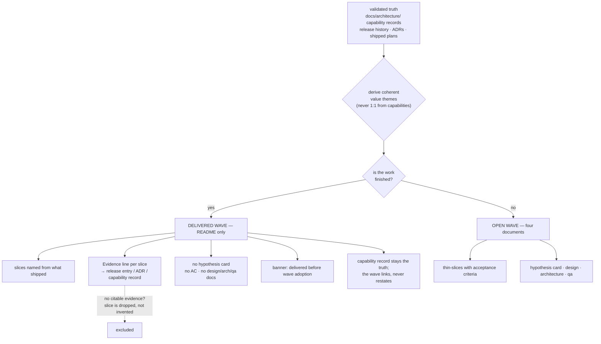

# ADR.260725.10: Retrofitting waves onto an existing product — derive from truth, never fabricate history

**Status:** Accepted
**Date:** 2026-07-25
**Accepted:** 2026-07-25 by Wael Rabadi (maintainer)
**Deciders:** Wael Rabadi (maintainer) + Principal Engineer persona

> **Approval mechanics:** `status` is the mechanical gate between architect mode and implementer mode for Major-tier changes. Implementer mode REJECTS the work if `status` is not `Accepted`. Pair this status with a signed Design Approval line in the active sprint file (see `create-sprint`). Both signals are required.

---

## Context

Praxis adopted its own wave pattern after four releases had already shipped. The product it describes existed before the artifact that is supposed to describe it. That is not a Praxis peculiarity — it is the normal condition of every project that adopts a delivery method, and Praxis has no path for it.

The existing skills do not cover this case:

- `bootstrap-project` is greenfield. It scaffolds an empty repo.
- `refactor-layered-to-capability` migrates legacy **code structure** into vertical slices. It says nothing about legacy **product intent**.
- `create-wave` assumes the wave precedes the work.

So the only available answer has been the one Praxis gave itself: declare pre-adoption planning documents an archive and start fresh. That answer is weak. It leaves the delivered product undescribed in product terms, gives a new contributor no intent map for anything built before adoption, and provides the most common adoption question — *"my product already exists, now what?"* — no answer beyond "begin from here."

The reason the question was avoided rather than answered is a genuine doctrine risk. Praxis rejects manufactured artifacts: an ADR whose alternatives were reverse-engineered to justify a decision already made, a hypothesis card written after the outcome is known. Retrofitting waves *looks* exactly like that, and one form of it is exactly that.

The decisive observation is that **two different operations are being conflated**:

1. **Fabricating history** — writing thin-slice acceptance criteria for work that shipped without them, and hypothesis cards whose "decision: continue" was taken months ago. The artifact then asserts validated learning it does not contain. This is theater, and the objection to it is correct.
2. **Deriving the intent map from validated truth** — reading the capability records, the release history, and the shipped plans, and naming the coherent value themes the product has actually delivered. Nothing is invented, because `docs/architecture/` already *is* the truth and the release history is already evidence. This is a reorganization of known facts into the shape that makes intent legible.

The first is forbidden. The second is ordinary documentation work, and refusing it because it resembles the first is a category error that has cost Praxis its own intent map.

---

## Decision

**We will retrofit waves onto an already-delivered product by deriving them from validated truth, at two fidelity levels distinguished by whether the work is finished.**

**Derivation rule — value themes, not code structure.** Waves are named for coherent slices of product value. They are explicitly **not** mapped one-to-one from capabilities: `skills/`, `enforcement/`, and `distribution/` are code-ownership boundaries, and turning each into a wave would produce the "waves as implementation buckets" anti-pattern `create-wave` already prohibits. A single wave may cut across all three capabilities, and a single capability may serve several waves.

**Delivered waves — README only.**

- Thin-slices are named from what actually shipped, and each carries an **Evidence** line pointing at a release entry, an ADR, or a capability record. Evidence replaces acceptance criteria: the criteria were never written, and inventing them retroactively is the fabrication this ADR exists to prevent.
- **No hypothesis card.** A validation method and continue/pivot/stop decision for a settled outcome is a fiction.
- **No `product-design.md`, `product-architecture.md`, or `qa.md`.** The wave's educated theory is moot once the work is built, and the truth already lives in the capability record. The README links there instead of restating it.
- A banner marks the wave as delivered before wave adoption, so no reader mistakes it for wave-executed work.

**Open waves — the full four-document set,** because their intent genuinely is forward-looking and their theory is not yet settled.

**Evidence must be citable, not asserted.** A delivered slice with no release entry, ADR, or capability-record passage to point at does not become a slice. It is either dropped or recorded honestly as undocumented prior work.

---

## Rationale

| Criterion | How This Decision Satisfies It |
| --- | --- |
| Separates the forbidden operation from the legitimate one | Fabrication is barred by construction: no acceptance criteria, no hypothesis cards, no educated theory for delivered work. What remains is citation of existing records, which invents nothing. |
| Makes the distinction visible to a reader, not just to the author | The two tiers are structurally different — a delivered wave has one document and an Evidence line where an open wave has four documents and acceptance criteria. A reader can tell which they are looking at without being told. |
| Closes the adoption gap that actually blocks adopters | Brownfield is the normal case. A method whose only entry point is greenfield is a method most teams cannot start using. |
| Refuses the cheap version of both extremes | Full four-document retrofit would fabricate; an index-only table would leave future slices with no upstream source to hang off. Two tiers gives the delivered work a real home without pretending it was planned. |
| Keeps the anti-theater rule intact where it earns its keep | Nothing here relaxes the rule against manufactured reasoning. It narrows the rule to what it was protecting: claims of validated learning that never happened. |

---

## Architecture Snapshot (as of this decision)

<!-- The shape this decision commits to, frozen at decision time. This is a
     point-in-time snapshot, NOT the living architecture. Current-state topology
     lives in the capability record (docs/architecture/skills/). -->

Resilience posture committed by this decision: none. This is a documentation and method decision with no runtime boundary, external call, or request path.

---

## Alternatives Considered

| Option | Pros | Cons | Why Not Chosen |
| --- | --- | --- | --- |
| **Two-tier retrofit: README-only for delivered, full four documents for open (Chosen)** | Gives delivered work a real intent home with citable evidence; makes the fidelity difference structurally visible; closes the brownfield gap; fabrication is impossible by construction because the fabricable sections do not exist in the delivered tier. | Two shapes of wave document to understand; a reader must know why some waves have one file and others four; the delivered tier is a genuinely new artifact form the method did not previously have. | Selected — the only option that produces the intent map without asserting learning that never happened. |
| **Full four-document set for every wave, including delivered ones** | Uniform structure; complete dashboard; nothing appears second-class; one shape to learn. | Requires inventing acceptance criteria and hypothesis cards for shipped work — precisely the manufactured artifact the method rejects. Worse, it would model that behavior in the repo adopters read as the reference example. | Rejected — it produces exactly the theater the anti-fabrication rule exists to stop, and does so in the most visible possible place. |
| **Wave index only — a roadmap table, no per-wave folders** | Zero new artifacts and zero fabrication risk; cheapest possible; the capability records already hold the truth being pointed at. | Leaves future slices with no upstream source: `create-sprint` pulls slices *from a wave README*, so a table cannot anchor new work. Reproduces in miniature the precondition deviation that forced slices to be defined inside a sprint. | Rejected — it solves the description problem and leaves the structural problem, which is the one that actually broke. |
| **Keep the status quo: pre-adoption work stays an archive** | Requires nothing; strictest possible reading of the anti-fabrication rule; no risk of a retrofitted artifact being mistaken for a planned one. | Leaves the delivered product undescribed in product terms, gives new contributors no intent map, and answers the most common adoption question with "start over." Also inconsistent: the capability records already describe delivered work, and nobody calls those fabrication. | Rejected — the inconsistency is the tell. Describing delivered work is already accepted practice on the engineering side; refusing it on the product side is not principle, it is an unexamined asymmetry. |

---

## Consequences

### Positive

- Praxis gains its own intent map, derived from records that already existed, and a new contributor can see what the product is for without reading four releases of CHANGELOG.
- The brownfield adoption question has an answer, and Praxis is its first worked example rather than a counter-example.
- The anti-fabrication rule gets sharper rather than weaker: it now names the operation it forbids (asserting unearned validated learning) instead of blocking anything that resembles it.
- Delivered waves give future slices a legitimate upstream home, so later work on a delivered theme does not have to define slices inside a sprint the way the self-conformance work was forced to.

### Negative

- Two document shapes exist under `docs/product/waves/`, and the reason is not self-evident from the file tree alone — it has to be read here or in the banner.
- A delivered wave is a lossy summary. It records what shipped, not the reasoning at the time, which is only in ADRs where they exist and nowhere where they do not.
- This contradicts text currently in `docs/product/README.md` declaring `docs/plans/` an archive *rather than* retrofitting. That text must change, and until it does the repo asserts both positions.
- The retrofit is a judgment call about what constitutes a coherent value theme, and a different author would draw different boundaries. There is no mechanical check that the derived set is the right one.

### Risks & Mitigations

| Risk | Likelihood | Mitigation |
| --- | --- | --- |
| A delivered wave is later mistaken for wave-executed work, and its absent hypothesis card read as an omission | Medium | Mandatory banner on every delivered wave README stating it was delivered before wave adoption; the structural absence of the four-document set is itself the signal. |
| The two-tier rule becomes an excuse to skip the four documents on genuinely open work | Medium | The tier is decided by one question — is the work finished? — not by convenience. An open wave with a README only is a defect, catchable by review and, if it recurs, by a check. |
| Evidence lines rot as the CHANGELOG is edited or release anchors change | Medium | Check #14 (link resolution) already fails the build on a dead relative link, which covers anchor targets at file granularity. Anchor-fragment validation is not covered and is a known gap. |
| Retrofitted slices get reopened and edited as though they were live intent, turning a delivered wave into a changelog | Low | Delivered waves are closed records; new work on the same theme becomes a new slice with acceptance criteria, moving that wave into the open tier if it resumes. |
| The derived theme boundaries prove wrong and the whole set needs redrawing | Medium | Waves are cheap to re-cut while nothing depends on them. Redraw before the first sprint pulls a slice from a retrofitted wave, not after. |

---

## Implementation Notes

- Waves derived for Praxis: the method spine, multi-harness reach, executable seams, production-readiness posture, and trust transfer as **delivered**; self-conformance and brownfield adoption as **open**.
- Deliberately not derived: one wave per capability. `skills`/`enforcement`/`distribution` are ownership boundaries; the derived waves cut across them.
- `docs/product/README.md` lost the sentence declaring `docs/plans/` an archive *rather than* retrofitted, and gained the wave index.
- **`docs/plans/` has since been removed entirely.** The retrofit made it redundant in two steps: the delivered work its plans described is now cited as evidence by the derived waves, and its one still-open commitment — the sprint footprint and the disjointness and contract-freshness probes — was migrated into `TS-005` of the executable-seams wave, where that wave's `product-architecture.md` is now its only home. The removal is consistent with this ADR rather than an exception to it: no shipped plan was rewritten into wave shape, and nothing open was discarded. Three earlier ADRs (`ADR.260720.01`, `.02`, `.03`) still cite a `docs/plans/praxis-course-correction-2026-07.md` that was pruned before this decision; those citations are dangling and are deliberately left, because an Accepted ADR records what was true at decision time and is superseded rather than edited. <!-- praxis:allow-path reason="immutable decision record citing the plan that motivated it; that plan was removed with the pre-adoption archive" -->
- Evidence citation avoids semver literals in `docs/product/waves/`, which check #13 would reject. Delivered slices cite release entries by CHANGELOG anchor link with descriptive link text. This is a workaround for the gap `ADR.260725` addresses; once its Layer 1 lands, a version inside a code span becomes citable directly.
- Turning this pattern into a first-class adoption path (a skill, or a documented section of `bootstrap-project`'s counterpart) is `TS-001` of the brownfield-adoption wave. It is deliberately **not** generalized here — one instance is not evidence, and the evolution policy requires real-repo validation before a rule ships.

---

## Related Documents

- **Capability record (living architecture this decision shapes):** [CAP.method-spine-and-execution](../../capabilities/CAP.method-spine-and-execution.md)
- **System overview:** `docs/architecture/README.md`
- **Product dashboard carrying the derived index:** `docs/product.md`
- **Wave slice generalizing this into an adoption path:** `TS-001` of `wave-brownfield-adoption`
- **Supersedes / Superseded by:** none
- **Related ADRs:** `ADR.260724` (wave category relaxation) — removed the taxonomy that would have forced each derived wave into a product-org bucket, which is what made deriving by value theme possible; `ADR.260725` (declared exceptions move inline) — its Layer 1 would remove the evidence-citation workaround noted above.
