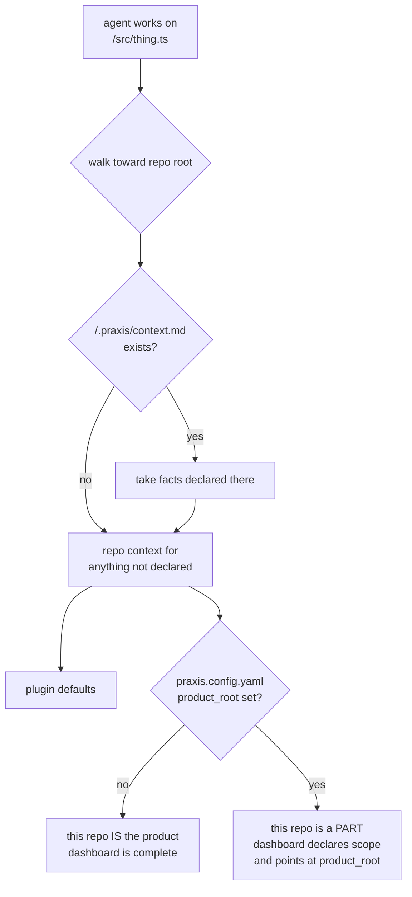

# ADR.260725.17: Context placement beyond one repository — precedence, not generation

**Status:** Accepted
**Date:** 2026-07-25
**Accepted:** 2026-07-25 by Wael Rabadi (maintainer)
**Deciders:** Wael Rabadi (maintainer) + Principal Engineer persona

> **Approval mechanics:** `status` is the mechanical gate between architect mode and implementer mode for Major-tier changes. Implementer mode REJECTS the work if `status` is not `Accepted`. Pair this status with a signed Design Approval line in the active sprint file (see `create-sprint`). Both signals are required.

---

## Context

Praxis assumes the repository is the unit of the product. `docs/project-context.md` describes one project, `docs/product/waves/` holds that project's intent, and `docs/product/README.md` claims to show "what is being built" whole. Every one of those assumptions breaks in the two most common shapes real products actually have.

**A monorepo of many packages.** One `project-context.md` cannot describe twelve packages with different stacks, test commands, and ownership. Written broadly enough to be true of all twelve, it is too vague to guide any one; written for one, it is wrong about eleven.

**A product spanning several repositories.** `docs/product/waves/` in any single repository is a partial truth presented as the whole. A reader opening the dashboard in the payments repo sees "the product" and is looking at a fragment, with nothing telling them so.

This was carried as explicitly out of scope by `wave-self-conformance` — *"genuinely unsolved design work, not merely unscheduled"* — and by `wave-multi-harness-reach`, which solved single-tree reach across six harnesses and deliberately did not solve this. It is `TS-002` of `wave-brownfield-adoption`.

That wave's `product-architecture.md` states the decision this ADR owes an answer to:

> whether multi-package and multi-repository context resolution is a precedence rule the agent applies at read time, or a generation step that materializes per-package context from one source. That choice determines whether the dual-home generator discussed in `TS-007` of wave-self-conformance is a dependency or an alternative.

Two facts constrain the answer. First, **Praxis already has a precedence mechanism** — a four-tier stack in `docs/project-context.md` § *Layering and precedence*, where repo guidance overrides plugin guidance and the most specific tier wins. Second, **Praxis already has a path-configuration surface** — `praxis.config.yaml`'s `paths.*` keys, consumed by `provision-project-overlay` and rendered into every generated overlay file.

---

## Decision

**Context resolution beyond one repository is a precedence rule applied at read time. It is not a generation step.**

**1. A package tier is added to the existing precedence stack.** The stack gains one level above the repository:

```
package  <pkg>/.praxis/context.md, <pkg>/.github/          (most specific)
repo     .github/copilot-instructions.md, .claude/CLAUDE.md
repo     .github/instructions/, .github/agents/, .github/skills/
─────────────────────────────────────────────────────────────
plugin   instructions/, agents/, skills/                   (Praxis defaults)
user     ~/.claude/CLAUDE.md                               (personal)
```

The agent resolves by walking from the file it is working on toward the repository root, taking the nearest declaration of each fact. A package declares **only what differs** from the repository; anything it does not state, it inherits.

**2. This dissolves the dual-home problem rather than solving it.** Under precedence, a fact never lives in two places — it lives at the level where it is true. The generator discussed in `TS-007` is therefore an **alternative that was not needed**, not a dependency. `TS-002`'s third acceptance criterion ("content that legitimately belongs in two places is generated from one source rather than hand-synced") is satisfied by construction: precedence means there is no second place.

**3. No repository claims the whole product's intent.** For a product spanning repositories, `praxis.config.yaml` gains one key:

```yaml
paths:
  product_root: ../product-intent    # path, URL, or omitted
```

- **Omitted** — this repository is the product. Current behavior, unchanged, and the default.
- **Set** — this repository is a *part*. Its dashboard must open by saying so and pointing at the whole; wave documents live at `product_root`, and the local `docs/product/` holds only slices this repository implements.

The rule is that a dashboard states its own scope. A partial dashboard that announces it is partial is honest; one that does not is the defect.

**4. Nothing becomes mandatory for a single-repository project.** Every mechanism above is inert when `product_root` is unset and no package tier exists — which is every project Praxis serves today.

---

## Rationale

| Criterion | How this decision satisfies it |
| --- | --- |
| Extends a mechanism that exists rather than adding one | Precedence is already how Praxis layers guidance, and most-specific-wins is already the rule. This adds a level; it invents no concept. |
| Cannot drift | Generated per-package context is N copies needing a `--check` gate to stay honest. Precedence has one copy of each fact, read directly. There is nothing to sync, so nothing can desync. |
| Works across repository boundaries | Generation cannot cross a repository boundary — you cannot materialize a file into a repo you are not in. Precedence plus an explicit pointer works in both shapes with one rule. |
| Degrades honestly on weak harnesses | Copilot applies `applyTo` globs per file, so package scoping is native. Harnesses without `applyTo` already treat the always-on summary as authoritative; those read the nearest context file, which is the same resolution done manually. |
| Keeps the single-repo case untouched | Inert by default. A project that is one repository sees no new file, no new key, and no new step. |
| Makes partiality visible | The failure mode is not a missing dashboard, it is a *confident* one. Requiring a partial dashboard to declare its scope targets the actual defect. |

---

## Architecture Snapshot (as of this decision)

<!-- The shape this decision commits to, frozen at decision time. Point-in-time,
     NOT the living architecture; current state lives in the capability record. -->



Resilience posture committed by this decision: none. Context resolution is read-time document lookup with no runtime boundary, external call, or request path.

---

## Alternatives Considered

| Option | Pros | Cons | Why Not Chosen |
| --- | --- | --- | --- |
| **Read-time precedence with a package tier and an explicit product-root pointer (Chosen)** | Extends the existing four-tier stack; no generated copies so no drift and no `--check` gate; one rule covers monorepo and multi-repo; inert for single-repo projects. | Requires the agent to walk toward the root, which is a behavior rather than an artifact — weaker to verify mechanically than a generated file's presence. | Selected. It is the only option that works across a repository boundary, and it removes the duplication problem instead of managing it. |
| **Generate per-package context from one source** | Each package gets a complete, self-contained file; no traversal behavior to rely on; presence is trivially checkable. | N copies of every inherited fact, needing a generator plus a `--check` gate purely to prevent drift the other option cannot have. Cannot cross a repository boundary at all, so multi-repo stays unsolved and needs a second mechanism. | Rejected. It manufactures the dual-home problem and then builds machinery to contain it, while solving only half the stated scope. |
| **Declare monorepos out of scope; require one repo per Praxis project** | Zero new mechanism; the current assumptions all stay true. | Rules out the majority of real adoption targets. The wave exists because "keep an archive and start fresh" is the weakest guidance in the method, and this would be its equivalent for repository shape. | Rejected. It answers the adoption question by declining the adopters. |
| **A registry file listing every package and its context** | One place to look; easy to validate; no traversal. | A second source of truth about a structure the filesystem already encodes, and it goes stale the moment a package is added. Reintroduces exactly the path-list shape [ADR.260725](ADR.260725-inline-declared-exceptions.md) retired. | Rejected on that precedent — a list that must be maintained alongside a tree drifts from the tree. |

---

## Consequences

### Positive

- The most common adoption shapes stop being unsupported.
- A fact lives at the level where it is true, so per-package divergence becomes expressible instead of a reason to write vaguely.
- The dual-home generator is retired as a concept rather than deferred again — one fewer speculative dependency across two waves.
- A partial dashboard becomes self-describing, which is the honest failure mode for a product nobody can see whole from one repository.

### Negative

- Resolution is a **behavior**, not an artifact. Praxis can check that a package context file parses; it cannot mechanically prove an agent walked the tree correctly. This lands in the agent-attested tier of the enforcement split, which is the weakest tier.
- `product_root` pointing at a URL is unverifiable from inside the repository. A link-resolution check cannot follow it.
- The precedence stack grows from four tiers to five. The stack is documented in several places and each gains a level to state correctly.

### Risks & Mitigations

| Risk | Likelihood | Mitigation |
| --- | --- | --- |
| Agents ignore the package tier because no gate enforces it | **High** | Accepted and stated rather than papered over. It is agent-attested by nature. The mitigation is placement, not enforcement: the package tier goes in the always-on guardrail summary, which is re-injected every session, rather than only in `project-context.md`. |
| A partial dashboard ships without declaring it is partial | Medium | Mechanically checkable: when `product_root` is set, require the dashboard to carry a scope-declaring phrase, via the existing `.praxis-canon.json` `requiredPhrases` mechanism. |
| `product_root` becomes a second place waves can live, so nobody knows which is authoritative | Medium | It is a pointer, never a home. The rule is one-directional: a part repo points at the whole; the whole never points back at parts. |
| Adopters set `product_root` and then keep a full dashboard locally anyway | Medium | The required phrase makes the contradiction visible in the same file. |

---

## Implementation Notes

- Precedence stack: `docs/project-context.md` § *Layering and precedence*, `skills/using-praxis/SKILL.md`, `.claude/CLAUDE.md`, and the overlay template that renders it.
- Config: `paths.product_root` in `praxis.config.yaml.tmpl` and `provision-project-overlay`'s interview and defaults table.
- Scope declaration: a `requiredPhrases` entry conditional on `product_root` being set.
- **Not** to be built: the dual-home generator. This decision retires it; `TS-007` of wave-self-conformance already narrowed away from it for the same reason.
- Deliberately undecided: whether a package tier may override a *guardrail* or only project facts (stack, paths, commands). No real case exists yet, and inventing the rule without one is the speculative generality this method rejects.

---

## Related Documents

- **Capability record:** [docs/architecture/skills/README.md](../skills/README.md)
- **System overview:** [docs/architecture/README.md](../README.md)
- **Wave slice implementing this:** `TS-002` of `wave-brownfield-adoption`
- **Supersedes / Superseded by:** none
- **Related ADRs:** [ADR.260725.10](ADR.260725.10-brownfield-wave-retrofit.md) (deriving waves from delivered history — the sibling slice in this wave); [ADR.260725](ADR.260725-inline-declared-exceptions.md) (retiring maintained path lists, the precedent that rejects the registry alternative).
