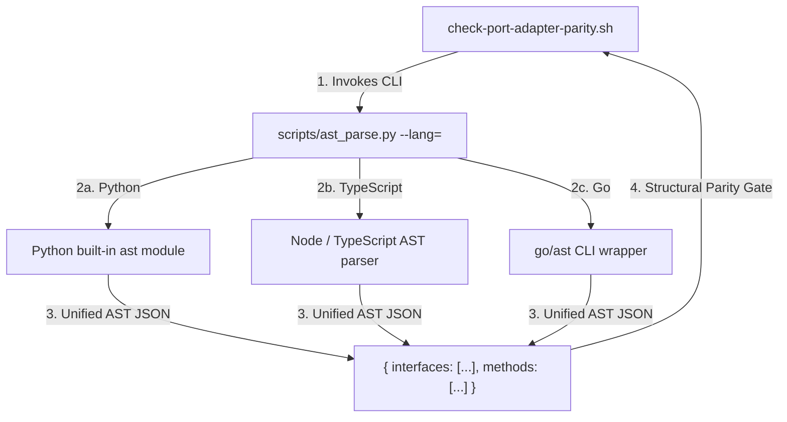

# ADR.260811.01: Multi-Language AST Parsing Infrastructure for Validation Probes

- **Status:** Accepted
- **Date:** 2026-08-11
- **Deciders:** Principal Engineer, Product Designer, Product Manager
- **Capabilities Touched:** `CAP.plugin-conformance-and-validation-probes`, `CAP.method-spine-and-execution`

---

## Context & Problem Statement

Praxis validation probes (`check-port-adapter-parity.sh`, `check-seam-contract-parity.sh`, `check-observability-at-seams.sh`) historically relied on string-matching regular expressions to inspect source files for interface definitions and implementation calls. While fast, regex pattern matching breaks down on:

1. **Multiline Interface & Method Declarations:** Signatures split across multiple lines or carrying generic parameters (`<T extends BasePayload>`).
2. **Language Syntax Differences:** Python `Protocol`/`ABC` classes, TypeScript `interface`/`type` constructs, and Go `struct`/`interface` declarations.
3. **Docstrings & Comments:** Commented-out interface definitions triggering false positives.

We need a unified, high-performance AST (Abstract Syntax Tree) parsing mechanism that supports Python, TypeScript, and Go without introducing heavy native binary C-compilation dependencies (e.g. native `tree-sitter` binaries) that complicate multi-harness distribution.

---

## Decision Driver & Litmus Questions

1. **Does regex parsing provide sufficient precision for cross-language seam contracts?** No. AST node extraction is required to reliably verify method parameters and type signatures.
2. **Can we adopt a native C binary dependency?** No. Cross-compiling C-extensions across Linux/macOS/Windows and six harnesses violates Praxis single-source distribution principles.
3. **Can standard language tools supply lightweight JSON ASTs?** Yes. Python's built-in `ast` module, Node's built-in `typescript` parser, and Go's `go/ast` provide zero-dependency JSON AST output.

---

## Proposed Architecture & Decision

We establish **`scripts/ast_parse.py`** <!-- praxis:allow-path reason="unreleased script planned for TS-030 in `v0.7.0`" --> as the single CLI entry point for AST node extraction across the Praxis enforcement suite.



### Seam Contract Interface (`ast-parser@v1`)

```json
{
  "file": "src/checkout/port.ts",
  "language": "typescript",
  "interfaces": [
    {
      "name": "CheckoutPort",
      "line": 14,
      "methods": [
        {
          "name": "processOrder",
          "params": [{ "name": "order", "type": "OrderPayload" }],
          "returnType": "Promise<OrderResult>"
        }
      ]
    }
  ]
}
```

---

## Consequences

### Positive
- **100% Precision:** Eliminates regex false positives/negatives on multiline interfaces and commented code.
- **Zero Binary Setup:** Relies entirely on runtime environments already present in standard developer setups (Python 3, Node.js, Go).
- **Sub-second Performance:** AST parsing completes in $< 500\text{ms}$ across large codebases.

### Negative / Trade-offs
- Requires Python 3 interpreter on developer machines (already required by Praxis enforcement tooling).

---

## Related Documents

- **Living Capability Record:** [CAP.plugin-conformance-and-validation-probes](../../capabilities/CAP.plugin-conformance-and-validation-probes.md)
- **Target Initiative:** [INIT.ast-seam-and-probe-validation](../../product/initiatives/INIT.ast-seam-and-probe-validation.md)
- **System Overview:** [docs/architecture/README.md](../README.md)
