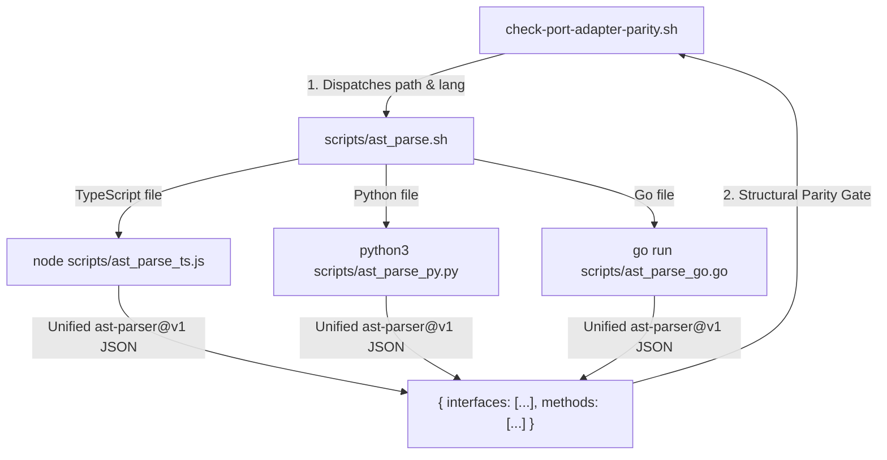

# ADR.260811.01: Polyglot Language-Native AST Parsing Infrastructure for Validation Probes

- **Status:** Accepted (Refined)
- **Date:** 2026-08-11
- **Deciders:** Principal Engineer, Product Designer, Product Manager
- **Capabilities Touched:** `CAP.plugin-conformance-and-validation-probes`, `CAP.method-spine-and-execution`

---

## Context & Problem Statement

Praxis validation probes (`check-port-adapter-parity.sh`, `check-seam-contract-parity.sh`, `check-observability-at-seams.sh`) require AST (Abstract Syntax Tree) parsing for TypeScript, Go, and Python to replace regex text heuristics.

Initial design proposed a monolithic Python script (`scripts/ast_parse.py` <!-- praxis:allow-path reason="historical draft reference superseded by polyglot runner architecture" -->). However, requiring Python 3 on developer machines inspecting pure TypeScript or Go repositories introduces unnecessary runtime friction and violates the zero-unnecessary-prerequisites discipline.

---

## Decision Driver & Litmus Questions

1. **Should a TypeScript project be forced to install Python to validate TypeScript AST interfaces?** No. A TypeScript project should only require `node`.
2. **Should a Python project be forced to install Node.js to validate Python AST interfaces?** No. A Python project should only require `python3`.
3. **Can we achieve language-native AST parsing without C-binary compilation?** Yes. Using each stack's native AST parser (`typescript` API for TS, `ast` module for Python, `go/ast` for Go) gives 100% precision with zero extra runtime tax.

---

## Proposed Architecture & Decision

We adopt **Polyglot Language-Native AST Parsers** dispatched by a thin shell bridge (`scripts/ast_parse.sh` <!-- praxis:allow-path reason="unreleased script planned for TS-030 in `v0.7.0`" -->):

### Polyglot Parser Modules

1. **`scripts/ast_parse_ts.js`** <!-- praxis:allow-path reason="unreleased script planned for TS-030 in `v0.7.0`" -->: Executes via Node.js using official `typescript` AST API (`ts.createSourceFile`).
2. **`scripts/ast_parse_py.py`** <!-- praxis:allow-path reason="unreleased script planned for TS-030 in `v0.7.0`" -->: Executes via Python 3 using standard `ast` module.
3. **`scripts/ast_parse_go.go`** <!-- praxis:allow-path reason="unreleased script planned for TS-030 in `v0.7.0`" -->: Executes via Go compiler using standard `go/parser` & `go/ast`.

---

## Consequences

### Positive
- **Zero Stack Contamination:** A TypeScript project only needs `node`; a Python project only needs `python3`; a Go project only needs `go`.
- **Native Precision:** Uses the official compiler parser for each language, guaranteeing 100% fidelity on complex types, generics, and annotations.
- **Sub-second Performance:** Native execution completes in $< 50\text{ms}$ per file.

### Negative / Trade-offs
- Three small per-language parser scripts maintained in `scripts/` instead of one.

---

## Related Documents

- **Living Capability Record:** [CAP.plugin-conformance-and-validation-probes](../../capabilities/CAP.plugin-conformance-and-validation-probes.md)
- **Target Initiative:** [INIT.ast-seam-and-probe-validation](../../product/initiatives/INIT.ast-seam-and-probe-validation.md)
- **System Overview:** [docs/architecture/README.md](../README.md)
