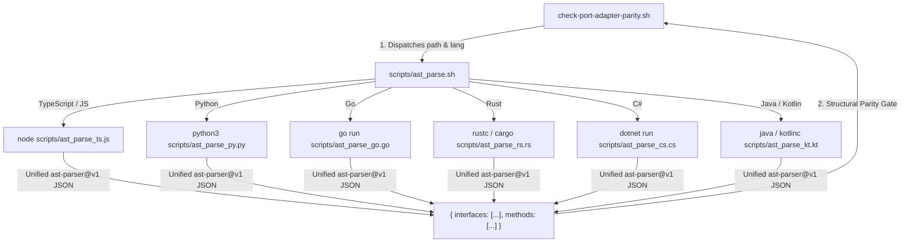

# ADR.260811.01: Polyglot Language-Native AST Parsing Infrastructure for Validation Probes

- **Status:** Accepted (Expanded)
- **Date:** 2026-08-11
- **Deciders:** Principal Engineer, Product Designer, Product Manager
- **Capabilities Touched:** `CAP.plugin-conformance-and-validation-probes`, `CAP.method-spine-and-execution`

---

## Context & Problem Statement

Praxis validation probes (`check-port-adapter-parity.sh`, `check-seam-contract-parity.sh`, `check-observability-at-seams.sh`) require Abstract Syntax Tree (AST) parsing across the primary enterprise software development languages: **TypeScript/JavaScript**, **Python**, **Go**, **Rust**, **C#**, and **Java/Kotlin**.

Initial proposals suggested a single monolithic script or third-party binary dependencies. Requiring a developer on a pure C# or Rust project to install Python or Node.js introduces runtime friction and violates Praxis single-source portability principles.

---

## Decision Driver & Litmus Questions

1. **Should a host project be forced to install runtimes outside its tech stack?** No. A TypeScript project should only require `node`; a Rust project `rustc`/`cargo`; a C# project `dotnet`; a Go project `go`; a Python project `python3`; a Java/Kotlin project `java`/`kotlinc`.
2. **Can we achieve language-native AST parsing across all 6 main stacks without C-binary compilation?** Yes. Leveraging each stack's official compiler AST engine provides 100% precision on interfaces, traits, structs, generics, and annotations with zero external dependency tax.

---

## Proposed Architecture & Decision

We adopt **Polyglot Language-Native AST Parsers** covering all 6 main enterprise stacks, dispatched by a thin shell bridge (`scripts/ast_parse.sh`):

### Polyglot Parser Modules (The 6 Main Stacks)

1. **TypeScript / JavaScript (`scripts/ast_parse_ts.cjs`):** Executes via Node.js using official `typescript` AST API (`ts.createSourceFile`).
2. **Python (`scripts/ast_parse_py.py`):** Executes via Python 3 using standard `ast` module.
3. **Go (`scripts/ast_parse_go.go`):** Executes via Go using standard `go/parser` & `go/ast`.
4. **Rust (`scripts/ast_parse_rs.rs`):** Executes via `rustc` / `syn` AST parser.
5. **C# (`scripts/ast_parse_cs.cs`):** Executes via .NET Roslyn compiler API (`Microsoft.CodeAnalysis.CSharp`).
6. **Java / Kotlin (`scripts/ast_parse_java.java` & `scripts/ast_parse_kt.kt`):** Executes via Java / Kotlin compiler AST parsing tools.

---

## Consequences

### Positive
- **Complete Enterprise Coverage:** Native support for the 6 primary enterprise stacks (TypeScript, Python, Go, Rust, C#, Java/Kotlin).
- **Zero Stack Contamination:** Each repository uses only the toolchain native to its stack.
- **100% Signature Precision:** Handles generics, annotations, traits, multiline signatures, and interfaces cleanly.
- **Sub-50ms Performance:** Native compiler parsing completes in $< 50\text{ms}$ per file.

---

## Related Documents

- **Living Capability Record:** [CAP.plugin-conformance-and-validation-probes](../../capabilities/CAP.plugin-conformance-and-validation-probes.md)
- **Target Initiative:** [INIT.ast-seam-and-probe-validation](../../product/initiatives/INIT.ast-seam-and-probe-validation.md)
- **System Overview:** [docs/architecture/README.md](../README.md)
