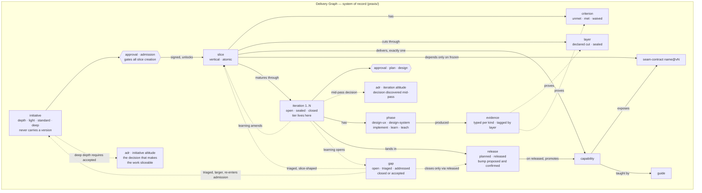
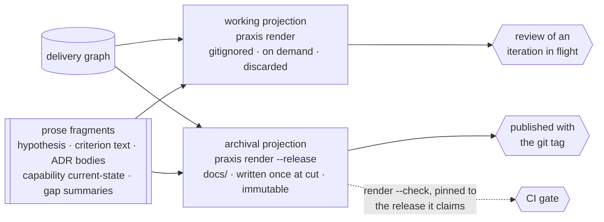

# ADR.260819.02: The Delivery Graph — Iteration-Native Thin Slices, Single-Writer State, and Perishable Markdown Projections

**Status:** Accepted
**Date:** 2026-08-19
**Deciders:** Principal Engineer, Product Manager, Product Designer

> **Sealed legacy record.** This document was authored under the prose-Markdown practice it
> replaces, and it is kept as the record of how the decision was made. It is **no longer a
> source**: the decision now lives in the delivery graph as node
> [`praxis/adr/ADR.260819.02.kdl`](../../../praxis/adr/ADR.260819.02.kdl) — whose `body` node
> carries this argument, whose `normative` block carries the enforceable schema, and whose
> `amendment` blocks carry every correction since acceptance — and the journey walk as
> [`praxis/initiatives/kdl-state-and-rust-cli-consolidation/journey.kdl`](../../../praxis/initiatives/kdl-state-and-rust-cli-consolidation/journey.kdl).
> Edit the graph, not this file. Pending archival.

> **Approval mechanics:** `status` is the mechanical gate between architect mode and implementer mode for Major-tier changes. Implementer mode REJECTS the work if `status` is not `Accepted`. Under the model this ADR adopts, the paired signal is a signed `design` approval node on the iteration rather than a line in a sprint file — Commitment 8 retires the sprint as a document. Both signals remain required.

---

## Context

Praxis exists to close the trust-transfer gap: a GenAI agent's artifact looks identical whether it reasoned hard or pattern-matched a template, so trust in it is unearned ([`docs/product.md`](../../product.md)). The method answers this with three enforcement tiers — script-enforced, human-signed, and agent-attested — and the largest and weakest tier is agent-attested: tier classification, intake envelope, red-first posture, and slice completion are trusted because the agent was asked to comply, with nothing able to check that it did.

That tier is large because of what the method's state is made of. Praxis holds its own operational state in prose Markdown, so enforcement's ceiling is what `grep` can conclude about paragraphs. A probe can prove a file exists and a phrase appears. It cannot prove that a slice claimed complete was ever designed, that a capability record reflects a slice that actually shipped, or that a guide describes a capability that still exists.

Three structural consequences follow, all observed in this repository:

1. **Load-bearing facts have many writers.** A slice's status is authored in the initiative's table, restated in the sprint that builds it, and restated again in the `docs/product.md` roadmap row. Nothing forces agreement, so they drift silently, and `close-sprint` asks an agent to hand-edit five documents in sequence with no transaction around them.
2. **The thin slice — the actual unit of value — has no representation.** It exists as a table row in one document, a scope line in another, and a checkbox in a third. A slice is vertical and atomic but rarely completes in one pass: it matures through design (UX and system), implementation, learning, and teaching, often across several iterations, and its learning feeds back into its own acceptance criteria or spawns new work. **The method has no way to say any of that.** A slice is either `⚪` or `✅`, which forces every partially matured slice to be recorded as a lie in one direction or the other.
3. **The loop has no terminator and no clock.** Learning is described as flowing back into the method, but a recorded gap is a note that nothing obliges anyone to act on, and nothing connects the moment work lands to the version it lands in. Documents therefore describe a present tense with no point on the version line attached to it, and a reader cannot tell which release a statement was ever true for.

[ADR.260819.01](ADR.260819.01-kdl-state-architecture-and-rust-cli-consolidation.md) correctly identified the symptom and committed to KDL state and a compiled Rust engine. Its state model, however, mirrors the current document tree one file per entity and synthesizes whole Markdown documents — including narrative — from typed nodes. That reproduces multi-writer duplication in a new syntax and pushes prose into the encoding least suited to authoring it. This ADR supersedes it, retaining its runtime and encoding commitments and replacing its state model and render semantics.

---

## Decision

**We will model the Praxis method as a typed delivery graph in which the thin slice is the central entity and the iteration is a first-class node; hold that graph as the single system of record; keep all narrative prose in Markdown fragments the graph references rather than inside graph nodes; bind work to a release only at the iteration that lands it; and treat every published Markdown document as a regenerable projection of the graph rendered for one specific release — a projection in time, never a source.**

The purpose of the graph is not storage. It is to convert fidelity from a behavior the agent is asked to perform into a property the tool can compute, and to close the learning loop with an obligation and a clock instead of a paragraph.

### Commitment 1 — Single-writer facts, edges by ID, nothing derived at rest

Every fact has exactly one owning node. Every other reference is an edge carrying an ID and nothing else. Rollups — slice counts, burndown, capability coverage, initiative progress — are computed at query time and never stored. Dangling edges fail at load, the way an unregistered `G-NNN` fails today.

Drift becomes unrepresentable rather than detectable, because there is no second copy to disagree with the first.

### Commitment 2 — The slice matures through iterations, and the loop back is an edge

A `slice` is vertical, atomic, and outcome-bearing. It holds one or more `iteration` nodes; each iteration holds `phase` nodes drawn from a closed vocabulary (`design-ux`, `design-system`, `implement`, `learn`, `teach`), each with a status and, where the phase produces one, an evidence reference.

Learning is an outbound edge from an iteration, not a paragraph: it amends the slice's acceptance criteria, opens a `gap`, or proposes a new `initiative`. The feedback loop the method has always described in prose becomes a traversable edge that a check can require and a projection can render.

### Commitment 3 — Prose lives in Markdown fragments the graph points at

The graph stores structure, identity, status, and edges. It never stores narrative. Hypotheses, criterion text, alternatives analysis, and consequences are authored as small Markdown fragments; nodes hold a path reference to them.

The boundary is not "data versus words" but **evaluability**: the graph owns everything it must reason over, and fragments own everything only a human reads. An acceptance criterion is therefore a node carrying `met`/`unmet` with its *text* in a fragment — because an invariant has to evaluate the state and no invariant can evaluate a paragraph.

Agents author prose in the format they generate most reliably, humans review it as a readable diff, and the data layer stays small enough to validate strictly.

### Commitment 4 — Published Markdown is a total projection rendered for one release

`praxis render` composes fragments plus generated rollups into whole documents. It never performs search-and-replace over an existing document.

Projections have **two lifetimes**, because review cadence and release cadence are not the same:

| | Working projection | Archival projection |
| --- | --- | --- |
| Rendered | On demand, at any moment | Once, at release cut |
| Destination | `praxis/.render/`, gitignored | `docs/`, committed with the tag |
| Depicts | The graph as it stands now | Exactly one `released` release |
| Purpose | Reviewing an iteration in flight | The record of what was true then |
| Lifetime | Discarded | Immutable, never regenerated |

Every document carries a header naming which of the two it is, so a preview is never mistaken for a record. **`praxis render --check` pins to the release its target claims** — it verifies that `docs/` still matches what the graph would produce *for the last released release*, not for the current graph. Checking against the current graph would fail continuously and correctly the moment work resumed after a release, which would train everyone to ignore it.

This is why `docs/` in a repository shows the last shipped truth rather than unshipped intentions, and why a reader can never be misled about which they are holding.

This is what makes perishability precise rather than vague: a document is not "eventually out of date," it is **valid for exactly one release and false for every other**. A reader who asks "was this ever true?" gets an answer.

### Commitment 5 — Fidelity gates become graph invariants

Checks that today are prose-scanned or merely asked for become traversals over typed nodes:

| Invariant | Today | Under the graph |
| --- | --- | --- |
| A `deep` initiative was admitted on an Accepted ADR | Agent-attested | Edge existence + status check at admission |
| A Major-tier iteration's mid-pass ADR is Accepted before sealing | Agent-attested | Edge existence + status check at seal |
| An iteration closed with unmet criteria carries a gap | Agent-attested | Edge existence, fails closed |
| Every completed phase produced evidence | Not checkable | Node presence check |
| Capability record reflects a delivered slice | Agent-attested | Reverse-edge traversal |
| Guide describes a live capability | Agent-attested | Reverse-edge traversal |
| Dashboard matches slice reality | Hand-maintained | Derived; drift impossible |
| Slice depends only on frozen contracts (disjointness) | Human review | DAG query over contract edges |
| Every opened gap is addressed or explicitly accepted | Register tracks mentions only | Gap with no resolution edge fails closed |
| A gap closes only through work that actually shipped | Not checkable | Traversal to a `released` release |
| The version bump matches what the release actually contains | Human judgment | Proposed from bound iterations, then checked |
| A capability record claims only what a release delivered | Agent-attested | Reverse traversal through release |
| A slice is fully functioning vertically | Agent-attested | Evidence at every layer the slice declared |

### Commitment 6 — Work reaches a version through the iteration that lands it

An initiative carries no version. It is educated theory until one of its iterations produces implementation change that must land, and **that iteration** — not the initiative — binds to a `release` node. An initiative's version footprint is derived from the releases its iterations bound to, never stored on the initiative, which would reintroduce the second writer Commitment 1 exists to remove. A single initiative spanning several releases is the normal case, not an exception.

A `release` holds a semver identity and a status (`planned` → `released`). Capability promotion follows the release, not the merge: an iteration may be implemented and still unreleased, and truth is only promoted into the capability record when the release it bound to reaches `released`.

The bump position is **proposed by the graph** from what the bound iterations touched — a breaking change to a frozen `seam-contract` proposes major, a new capability or slice outcome proposes minor, gap remediation alone proposes patch — then confirmed by a human. The graph records the confirmation, which makes the version claim checkable rather than asserted. This gives the method's existing evolution policy a mechanism instead of a convention.

Initiatives that never produce landable change terminate as `withdrawn` or `absorbed` without ever binding a release. Not every educated theory earns a version, and the model must be able to say so without pretending the work shipped.

### Commitment 7 — A gap is pending work, and closes only through delivered work

Learning opens a `gap`. A gap is not a note; it is an obligation with a lifecycle:

```
open ──► triaged ──► addressed-by ──► closed
          (sized)     (slice | initiative)   (released)
```

**Triage sizes the gap.** Remediation that stays inside one capability and needs no durable decision becomes a `slice` on an existing initiative. Anything crossing capability boundaries or requiring an ADR becomes a new `initiative`. Either way the new work re-enters the cycle at Commitment 2 and eventually binds a release through Commitment 6.

**The closing invariant:** a gap closes only when the work addressing it is bound to a release whose status is `released`. A gap cannot be closed by editing it, and cannot be closed by work that was merely planned. A gap the team chooses not to fix is `accepted` with a recorded rationale — a distinct terminal state from `closed`, so that deliberate debt and delivered remediation never read alike.

This is what turns the graph from a record into a loop:

```
initiative ──► slice ──► iteration ──► release
                 ▲            │
                 │            ▼
             slice or ◄──── gap
            initiative     (learning)
```

### Commitment 8 — The sprint is the iteration

Praxis models the sprint as an ephemeral, immutable bridge between product intent and engineering current state, created for a unit of work and deleted on close. That is a description of an iteration. **The two collapse into one entity: `iteration`.** `sprint` is retired as a separate artifact and a separate file lifecycle.

What the sprint contributed is preserved as properties of the iteration rather than as a document:

| Sprint property today | Where it lives under the graph |
| --- | --- |
| Scope is immutable once started | `iteration` seals its scope fields at open; a sealed field is append-only and a mutation attempt fails closed |
| Sprint Plan Approval | `plan` approval node on the iteration, required before it may seal |
| Design Approval (Major tier) | Approval node on the iteration, gated on any iteration-altitude ADR reaching `Accepted` |
| Ephemeral — deleted on close | Iterations are never deleted; a closed iteration is history, and history is what makes the maturity of a slice legible |
| Disjointness across parallel sprints | Query over active iterations rather than a scan of sprint files |

The one thing the sprint had that the iteration does not is deletion, and losing it is the point. Deleting the sprint is what erased the record of how many passes a slice actually took, which is the very thing Commitment 2 exists to make visible.

### Retained from ADR.260819.01

KDL as the presumptive encoding, the compiled Rust engine, the `praxis-core` / `praxis-cli` functional-core-and-imperative-shell split, domain profiles (`service`, `compiler`, `library`, `cli`), and hard-failing invariant gates all carry forward unchanged.

---

## Rationale

| Criterion | How This Decision Satisfies It |
| --- | --- |
| **Closes the trust-transfer gap** | Moves thirteen named checks out of the agent-attested tier — the tier that is trusted rather than verified — into tool-enforced traversals, verticality among them. This is the method's core purpose, advanced by a mechanism rather than by more prompt discipline. |
| **Eliminates staleness at the root** | Single-writer ownership plus derived-at-query rollups removes the second copy. Drift is not caught faster; it becomes unrepresentable. |
| **Reduces token consumption** | The agent reads a query result instead of five documents, and issues one mutation instead of five sequential edits with no transaction around them. Savings come from encapsulating the bookkeeping, not from the encoding. |
| **Makes the vertical slice real** | An atomic slice that matures across N iterations becomes expressible, so partial maturity stops being forced into a binary checkbox. This is the unit the method has always claimed to manage and has never been able to represent. |
| **Preserves human reviewability** | Prose stays in Markdown fragments that diff readably in a PR. The trust-transfer thesis depends on a human reading reasoning in review; a graph that swallowed prose would undermine the goal it serves. |
| **Closes the learning loop with an obligation** | A gap stops being a note and becomes pending work that can only be discharged by delivered change or an explicit, recorded acceptance. The method's feedback loop becomes something the tool can prove ran. |
| **Anchors every claim to a point in time** | Binding work to a release at the iteration that lands it gives every projection a version stamp, so "is this current?" becomes answerable by comparison rather than by trust. It also gives principle 4 — educated theory versus truth — a mechanical marker instead of an editorial one. |
| **Scales past one repository** | `paths.product_root` already contemplates a product spanning repositories. Graphs merge by ID; documents do not. |

---

## Architecture Snapshot (as of this decision)

### The delivery graph



Every node additionally carries `created-by`, `created-at`, and an append-only mutation trail, which the diagram omits only to stay legible.

### Projection pipeline



### Node ownership

The writer of each fact, with every other reference an edge:

| Fact | Sole owning node | Everything else holds |
| --- | --- | --- |
| Initiative depth and admission signature | `initiative` + its `approval` | `initiative-ref` |
| Slice outcome and delivered capability | `slice` | `slice-ref` |
| Whether a criterion is met | `criterion` | `criterion-ref` |
| Which layers a slice must cut, and their state | `slice`'s `cuts-through` edges | read-only to everything else |
| Iteration tier, seal state, and outcome | `iteration` | `iteration-ref` |
| Phase completion | `phase` | `iteration-ref` |
| Evidence, its kind, and the layer it proves | `evidence` | — |
| Approval signatures | `approval` | — |
| Gap lifecycle state and resolution edge | `gap` | `gap-ref` |
| ADR status and its provenance | `adr` | `admitted-on` by id, from the initiative side only |
| Capability current state | `capability` | `capability-ref` |
| Contract version freeze | `seam-contract` | `contract-ref` |
| Semver identity and release status | `release` | `release-ref` |
| Which release work landed in | `iteration` | derived upward to slice and initiative |

An initiative's version footprint, a release's slice manifest, a capability's delivery history, and a slice's completion state are all **derived traversals**, never stored. Storing any of them would recreate the multi-writer duplication this decision exists to remove — and, as the layout section shows, would create a file every agent must write.

---

## Entity & Edge Model

This is the one-way door. It is stated completely here so that it can be attacked before any engine exists.

### Node catalog

| Node | Identity | State | Key attributes | Notes |
| --- | --- | --- | --- | --- |
| `initiative` | `INIT.<intent-name>` | `proposed` · `active` · `withdrawn` · `absorbed` | intent, depth, hypothesis-ref, journey-ref | Never carries a version. `proposed` → `active` requires a signed `admission` approval. **`delivered` is not a stored state — it is derived from its slices** (F27). Depth ∈ light · standard · deep; `journey-ref` required at `deep` |
| `slice` | `TS-<id>` | `proposed` · `active` · `delivered` · `dropped` | outcome, capability-ref | Vertical and atomic; the unit of value |
| `criterion` | `<slice-id>.AC-<n>` | `unmet` · `met` · `waived` | text-ref, evidence-ref, gap-ref | Structured because invariant 4 must evaluate it (F17) |
| `iteration` | `<slice-id>.<n>` | `open` · `sealed` · `closed` · `abandoned` | tier, sealed-scope, outcome (`continue`/`pivot`/`stop`) | The sprint. Never deleted |
| `phase` | `<iteration-id>.<kind>` | `pending` · `active` · `complete` · `skipped` | kind, skip-rationale | Kind ∈ design-ux · design-system · implement · learn · teach |
| `approval` | `<parent-id>.<kind>` | `pending` · `signed` | kind, signer, timestamp | Attaches to an initiative or an iteration. Kind ∈ admission · plan · design |
| `evidence` | `<phase-id>.<n>` | — | kind + per-kind fields, layer | Sum type, validated per variant (F20). Kind ∈ verify-output · test-result · pr · trust-receipt · benchmark. `layer` ties evidence to the slice's declared cut |
| `gap` | `G-<ladder-id>` | `open` · `triaged` · `addressed` · `closed` · `accepted` | summary-ref, size, rationale-ref | Ladder id, allocable without coordination (F11). `accepted` requires a rationale |
| `release` | semver | `planned` · `released` | bump (proposed, confirmed), tag | Bump disagreement is queryable |
| `adr` | `ADR.<id>` | `proposed` · `accepted` · `superseded` | title, body-ref, supersedes-ref, raised-by | Existing ID ladder reused. `raised-by` is write-once provenance and survives its initiative being withdrawn |
| `capability` | `CAP.<name>` | `active` · `retired` | current-state-ref | The one node whose prose is rewritten in place |
| `seam-contract` | `<name>@vN` | `frozen` · `superseded` | shape-ref, suite-ref | Frozen means immutable |
| `guide` | `GUIDE.<name>` | `current` · `stale` | diataxis-kind, body-ref | `stale` is derived, not authored |

Every `*-ref` attribute that names prose points at a committed Markdown fragment. No node stores narrative inline, and no fragment restates a fact the graph owns (F16).

**Every node additionally carries `created-by`, `created-at`, and an append-only mutation trail** (F15). Attribution distinguishes human authorship from agent authorship, which is the distinction a method built on trust transfer exists to make legible.

The boundary between the two, sharpened by the walk: **the graph owns everything it must evaluate; fragments own everything only a human reads.**

### Edge catalog

**Cardinality convention:** the column states how many targets **each source** has. Where the reverse direction is load-bearing it is spelled out in the constraint, because the reverse is exactly where multi-writer mistakes hide.

**Logical direction is not storage side.** An edge's arrow says which way the relationship reads; concurrency rule 2 decides which file the reference is written in, and the two often differ. `contains` reads initiative → slice, but is **stored as `initiative-ref` on the slice** — if the initiative held a list of its slices, every slice creation would write the initiative file and two agents adding slices in parallel would collide on it. The rule: **the reference lives with the entity created later, which is the one the acting agent already owns.** Storage side is stated below wherever it is not obvious.

| Edge | From → To | Each source has | Constraint |
| --- | --- | --- | --- |
| `contains` | initiative → slice | 0..n | Reverse is exactly 1. **Stored as `initiative-ref` on the slice** — the initiative file is never written when a slice is added |
| `has-criterion` | slice → criterion | 1..n | A slice with no criteria cannot be closed or verified |
| `cuts-through` | slice → layer | 1..n | Layer ids come from the profile's vocabulary. Sealed at the slice's **first** iteration seal; a later iteration may change it only via an `amends` edge, never silently |
| `matures-through` | slice → iteration | 1..n | **At most one iteration in `open` or `sealed` per slice** |
| `has-phase` | iteration → phase | 1..n | Required phase set is a function of tier |
| `requires-approval` | initiative → approval | 1 | `admission`; unsigned means no slice may be created |
| `requires-approval` | iteration → approval | 0..2 | Required set is a function of tier, as the phase set is: Trivial requires none, Standard requires `plan`, Major requires `plan` and `design` |
| `produced` | phase → evidence | 0..n | A `complete` phase with zero evidence fails closed |
| `lands-in` | iteration → release | 0..1 | Reverse is 0..n — a release gathers many iterations. Present only when the `implement` phase completed |
| `promotes` | release → capability | 0..n | Fires only on `released` |
| `delivers` | slice → capability | 1 | Exactly one (F19). Reverse is 0..n — a capability is delivered by many slices over time |
| `admitted-on` | initiative → adr | 0..n | The accepted decisions this admission rests on. Mandatory when depth is `deep`. Reverse is 0..n — one durable ADR may admit several initiatives |
| `raised-by` | adr → initiative \| iteration | 0..1 | **Provenance, write-once at creation.** Which admission package or which pass produced this decision. Empty for ADRs predating the graph |
| `depends-on` | slice → seam-contract | 0..n | **Never slice → slice.** Dependency is only ever on a frozen contract |
| `exposes` | capability → seam-contract | 0..n | — |
| `taught-by` | capability → guide | 0..n | — |
| `opened` | iteration → gap | 0..n | Learning output |
| `addressed-by` | gap → slice \| initiative | 0..1 | Set at triage; determines size |
| `closed-by` | gap → release | 0..1 | Only a `released` release closes a gap |
| `amends` | iteration → slice | 0..1 | Learning that changes the slice's own criteria or layer set |
| `supersedes` | adr → adr, seam-contract → seam-contract | 0..1 | — |

**An iteration stores no ADR reference.** Invariant 3's seal gate is a traversal — *no ADR whose `raised-by` is this iteration may still be unaccepted* — so the requirement is derived rather than stored, which is Commitment 1 applied to a relationship that looked like it needed an edge.

### Structural invariants that fall out of cardinality

1. A slice with no `delivers` edge is malformed — verticality is asserted by naming what it delivers.
2. A slice cannot `depends-on` another slice. The only legal dependency is a frozen contract, which is how the four-condition disjointness rule becomes a query.
3. An iteration cannot seal while a required `approval` is `pending`, or while any ADR whose `raised-by` names this iteration is not yet `accepted`. The initiative's admission ADR was already accepted before any slice existed.
4. An iteration cannot close with unmet criteria unless it `opened` a gap.
5. A `complete` phase with no `evidence` fails closed; a `skipped` phase requires a rationale.
6. Two iterations of one slice cannot be active simultaneously.
7. **Tier is an attribute of the iteration, not the slice.** A slice's first iteration may be Major and its third Trivial; binding tier to the slice would force the whole slice to carry its heaviest pass forever.
8. No slice may exist beneath an initiative whose `admission` approval is unsigned.
9. A slice cannot reach `delivered` while any layer it declared lacks evidence.

### Verticality: the declared layer set

A slice is vertical when it cuts through **every layer it requires** — which is not the same as every layer that exists. Most slices legitimately touch a subset. What makes the property testable is that the slice **names its subset before it is built**:

- The **layer vocabulary comes from the profile** in `config.kdl`, never hardcoded. A service's strata are not a compiler's, and a tool that assumed otherwise would misjudge every non-service repository — the same lesson F22 taught about semver.
- The slice declares `cuts-through` for each layer it requires. The set is **sealed with the iteration scope**, so it cannot be trimmed at close to make "done" cheaper.
- `evidence` carries a `layer`, so completion at each declared layer is provable rather than asserted.
- **Done means fully functioning vertically through the declared layers**, which is what invariant 9 enforces.

Layers and phases are orthogonal and belong to different entities. **A layer is *where* in the stack, and belongs to the slice** — it is structural and stable across passes. **A phase is *when* in the pass, and belongs to the iteration** — design, implement, learn, teach. Conflating them would force a slice to re-declare its shape every iteration.

Sealing the layer set is what turns this from documentation into a gate. It is the same move the gap edge makes for unmet criteria: **the scope you must satisfy is fixed before you learn how expensive it is.** A slice that declares a single layer is reported rather than rejected — proportionality is the tier's job — but the report is what makes a horizontal fragment wearing a slice's name visible to a reviewer.

### Physical layout for concurrency

The graph is held in a git-backed filesystem mutated by many agents at once, so **the layout is a concurrency design, not a taxonomy.** The governing constraint is already in the method: the four-condition disjointness rule says legitimately parallel work is capability-disjoint and file-disjoint. The layout's job is to make that true physically — two agents doing disjoint work must never touch the same file, without locks or coordination.

```
praxis/
├── config.kdl                      profile · layer vocabulary · versioning policy · gates
├── initiatives/
│   └── <intent-name>/
│       ├── initiative.kdl          node · depth · admission approval · mutation trail
│       ├── hypothesis.md           prose, beside the node it belongs to
│       ├── journey.md              deep depth only — the walk and its findings
│       └── slices/                 does not exist until admission is signed
│           └── TS-<id>/
│               ├── slice.kdl       slice · criteria · declared layers
│               ├── ac-<n>.md       criterion text
│               └── iterations/
│                   └── <n>.kdl     iteration · phases · evidence · approvals
├── gaps/          G-<ladder-id>.kdl + G-<ladder-id>.md
├── releases/      <semver>.kdl
├── capabilities/  CAP.<name>.kdl + CAP.<name>.md   the current-state prose
├── contracts/     <name>@vN.kdl                    write-once, frozen
├── adr/           ADR.<id>.kdl + ADR.<id>.md       write-once after acceptance
├── README.md      what this tree is and how to read it
├── .render/       working projections              gitignored, discarded
└── .cache/        derived index                    gitignored, deletable at any time
```

The state root is **`praxis/`, visible and committed**, configurable as `paths.state` in `praxis.config.yaml` alongside the existing `paths.product_root`. Only the two generated subdirectories are dot-prefixed, which is the correct use of a dot: hiding machine artifacts, never content.

**The slice subtree is the unit of parallel work.** An agent working `TS-040` writes only under `slices/TS-040/`, where nothing else writes at all.

Four properties of this tree follow from decisions made elsewhere in this ADR:

- **Prose sits beside the node it belongs to**, not in a parallel `fragments/` tree. Co-location keeps a slice's data and narrative in one subtree, so the write-locality partition covers both and moving or deleting an entity stays a single atomic operation. A mirrored tree would double every path and split each entity across two places that must be kept in step — reintroducing exactly the coupling this decision removes.
- **`slices/` does not exist under an unadmitted initiative.** Progressive materialization is visible in the filesystem: an initiative that is never admitted is a `.kdl` file and its prose, and withdrawing it removes a leaf.
- **ADRs stay in a top-level `adr/`, not under the initiative that raised them.** An initiative is transient and can be `withdrawn`; an accepted ADR is durable and referenced across capabilities. Burying a durable decision inside a transient container would take it down with the container — which is why provenance travels as `raised-by` on the ADR rather than as containment in the tree.
- **The ADR index is a projection, not a file anyone maintains.** `docs/architecture/README.md`'s ADR table is a rollup over `raised-by` and `admitted-on`, so it is rendered like every other rollup. It was hand-edited three times over the course of authoring this ADR alone, which is the multi-writer problem stated in the Context happening in real time.
- **The mutation trail is appended inside each entity's own file**, never to a shared journal. A single journal would be the one file every agent writes — the worst contention shape available, and the exact anti-pattern rule 3 exists to prevent.

Five rules produce the concurrency property:

1. **One file per independently-mutated entity — never a registry file.** A single `gaps.kdl` holding `G-001…G-099` would serialize every agent that opens a gap. One file per gap means two agents opening two gaps create two different files, which git merges without conflict.
2. **Edges are stored on the side the acting agent already owns.** The gap holds `closed-by`; the release holds no manifest of gaps it closed. Whoever is acting writes only in their own subtree.
3. **Nothing derived is stored** — Commitment 1 restated as a concurrency rule. Every rollup file is by definition a file that every agent must write, which is the worst possible contention shape. Single-writer ownership and lock-free concurrency turn out to be the same design.
4. **IDs must be allocable without coordination.** This is why F12 cannot be closed without closing F11.
5. **Immutable entities are write-once**: frozen contracts, accepted ADRs, and released releases have zero contention by construction.

Contention analysis for the entities several agents could plausibly touch at once:

| Entity | Concurrent writers | Resolution |
| --- | --- | --- |
| `slice`, `criterion`, layer declarations, `iteration`, `phase`, `evidence`, and all their prose | One — the agent holding the slice | Partitioned by the slice subtree, data and prose together |
| `gap` | Many agents, but each opens its own | One file per gap; distinct filenames |
| `release` | Many iterations bind to one release | The **iteration** holds `lands-in`; the release file is written only when planned and cut |
| `capability` | Two slices delivering to the same capability | **Left as a conflict on purpose** — see below |
| `seam-contract`, `adr` | None after freeze or acceptance | Write-once |

**The capability case is the interesting one.** Two agents promoting into one capability in the same release will collide — and under the four-condition disjointness rule, that work was never legitimately parallel. **The layout makes a disjointness violation surface as a merge conflict**, which turns a rule that was previously enforced by human review into something the filesystem reports. The conflict is the signal, not a defect to engineer away.

One safety rule follows, and it is absolute: **never rely on git's textual merge for state files.** A three-way merge of two KDL edits can produce a syntactically valid document with a semantically wrong graph, which is worse than a conflict because nothing announces it. Files are either single-writer or add-only with distinct names; where neither holds, a conflict must be raised and resolved by re-running the mutation, never by merging hunks.

The cost is many small files, which trades against fast whole-graph reads. `praxis/.cache/` absorbs it with a derived index rebuilt on demand — legal precisely because it is a cache and not a record, so it may be deleted at any moment without loss and never merges, never conflicts, and never appears in a diff.

`praxis/.render/` is the other gitignored path: it holds working projections, which exist to be read once and thrown away. Both sit inside `praxis/` rather than elsewhere so that a single ignore rule covers everything the tool generates.

### State root: visible, committed, and outside `docs/`

Three placement questions were settled together, because they answer to the same objective.

**The record is committed, in full, minus the two generated directories.** A dot prefix would not have prevented that — git has never cared, and this repository already commits `.github/`, `.claude-plugin/`, and `.praxis-canon.json`. Committability was never the constraint.

**It is not hidden, because hiding it works against what Praxis is for.** A dot prefix means "tool state a human does not read," which is true of `.git` and `.cache` and false of this tree: it holds hypotheses, criterion text, ADR bodies, and capability current-state — human-authored prose that F13 makes the primary review surface between releases. A method whose entire purpose is making reasoning visible should not file that reasoning where `ls` omits it. There is also a name collision to avoid: `.praxis/` already denotes the monorepo package-tier context directory, and reusing it for the delivery graph would overload one path with two meanings.

**It does not live under `docs/`**, for two reasons that would each be sufficient. First, `docs/` is the *destination* of archival projections — putting source and generated output in one tree reintroduces exactly the source-versus-projection confusion Commitment 4 exists to remove, and gives `render --check` an ambiguous target. Second, `docs/product/` specifically would miscategorize the content: the graph holds ADRs, capabilities, seam contracts, and releases — engineering truth, which the method deliberately homes apart from product intent. A docs tree is also frequently the input to a publishing pipeline, and state files are not publishable pages.

**The record must outlive the tool.** Everything committed is KDL and Markdown — plain text, diffable, and readable by a human with no binary installed. If `praxis` the engine is abandoned, the delivery history remains legible; a contributor without the tool can still read and review. This is the same property that disqualified the embedded database in the alternatives table, and it is a hard constraint rather than a happy accident: **no format may be adopted for the committed record that cannot be read without the tool that wrote it.**

### Progressive materialization

Invariant 8 is one instance of a rule that governs the whole graph: **each level of structure is unlocked by the gate above it, and nothing below an unsigned gate may exist.**

| Gate | Unlocks |
| --- | --- |
| `admission` signed on the initiative | Slices may be created |
| Slice exists (so its initiative was admitted) | Iterations may open; the slice moves `proposed` → `active` on the first |
| Design phases complete, tier's approvals signed, any ADR this pass raised `accepted` | Iteration may seal |
| Iteration sealed | Implementation may begin |
| `implement` complete | Release binding may occur |

The purpose is to stop the graph from over-producing on intake. An initiative that arrives and is never admitted costs its reasoning and nothing else, so withdrawing it is free and no delivery structure has to be cleaned up.

**The line is between reasoning and structure, not between little and much.** Admission may legitimately require substantial work — research, design, an accepted ADR, a journey blueprint — and none of that is over-production, because all of it is prose fragments and at most one decision node. What is forbidden before admission is *delivery structure*: slices, criteria, iterations, layer declarations. Reasoning is what admission is decided on; structure is what admission unlocks.

### Depth of admission

How much reasoning an initiative needs before it can be admitted is proportional to its complexity, in the same way process is proportional to risk at the iteration. Some initiatives are understood well enough on their hypothesis alone and can be sliced immediately. Others cannot be sliced honestly until a durable decision has been made and tested.

| Depth | Admission package | Slices are obvious because |
| --- | --- | --- |
| **Light** | Hypothesis fragment | The work fits known patterns; the shape is already clear |
| **Standard** | Hypothesis + capability impact | The boundaries are known; only the sequencing needed thought |
| **Deep** | Hypothesis + **accepted ADR** + journey blueprint with recorded findings | The work is not sliceable until the model it depends on has been decided and walked |

A `deep` initiative is admitted on evidence that its decisions survived a walk, which is why the blueprint's findings are part of the package rather than a byproduct of it. **This ADR and the initiative it serves are themselves a `deep` admission**, and the sequence that produced them — initiative, then ADR, then research and design, then validation by journey walk, then approval of both — is the pattern the depth model generalizes.

### Altitude of decisions

Decisions live at the altitude where they are stable, and the two altitudes answer different questions.

| Decided at the **initiative**, before admission | Decided at the **iteration**, in its design phases |
| --- | --- |
| Durable architectural decisions (ADRs) | Concrete UX for this slice |
| The entity and boundary model | Data presentation and data collection |
| Which capabilities are touched | Endpoint patterns and naming |
| Whether the work is sliceable at all | The frozen `seam-contract` shape for this boundary |

The reason concrete surface decisions wait for the iteration is that **they must be informed by the codebase as it actually is, and by the patterns established up to that moment** — not by the codebase as it stood when the initiative was admitted. This is the sprint's original purpose, preserved: an iteration is the bridge between product intent and engineering current state, and naming an endpoint at initiative time would fix it against a reality that has since moved.

It follows that a slice's third iteration may name its surface differently from what its first would have, because the patterns it must match have changed. That is correct behavior, not drift.

---

## Alternatives Considered

| Option | Pros | Cons | Why Not Chosen |
| --- | --- | --- | --- |
| **A — Delivery graph + prose fragments + projections (Chosen)** | Drift structurally impossible; iteration model expressible; fidelity checks become traversals; prose stays reviewable and natively authored | Schema is a one-way door; two authoring surfaces; full-model adoption cost | Selected |
| **B — ADR.260819.01 as originally written: file-per-entity KDL mirror, whole-document synthesis** | Simple mental model; direct migration path from today's tree | Mirrors the current document tree, so status keeps multiple writers and drift survives the port; forces narrative into data nodes, the encoding's weakest surface and the agent's most expensive authoring path | Superseded. Changes the syntax without changing the property that causes the failure |
| **C — Status quo: Markdown state + shell probes** | Zero migration; maximal human readability; every harness already works | Enforcement ceiling is what grep concludes about prose; slice maturity inexpressible; `close-sprint` remains a five-file untransacted edit chain | Rejected. Leaves the largest enforcement tier permanently unverifiable |
| **D — YAML frontmatter in existing Markdown + derived index** | Near-zero migration; one file per artifact; keeps prose primary; strong model priors on frontmatter | One document still owns many facts, so multi-writer duplication persists; nested structures (iterations within slices) fit frontmatter poorly | Rejected as the destination. Viable as a migration waypoint if adoption friction proves higher than projected |
| **E — Embedded relational store (SQLite)** | Real queries, transactions, and referential integrity for free; mature tooling; fastest path to Commitment 1 | Binary file: unreviewable in a PR, no meaningful diff, merge conflicts unresolvable by hand | Rejected. Praxis's value rests on a human reviewing the record; a state store that cannot be read in review defeats the purpose it would serve |

---

## Journey Blueprint — Falsifying the Model Before Building It

The entity model above is a hypothesis. **The journey is the instrument that tests it:** a single walk that carries one intent from intake through a vertical slice, its iterations, a release, its learning, and back around through a gap. Its purpose is not to demonstrate that the model works. It is to find where the model is complex, ambiguous, or silent — before that ambiguity is compiled into Rust and shipped to adopters.

The walk is run at two altitudes at once, because each catches what the other misses:

- **Product design** — what the human or agent invokes at each stage and what comes back. Stages that read cleanly in the abstract often turn out to need a command that nobody designed.
- **Anticipated data** — the concrete node and edge instances the stage materializes, with real values. Shapes that look complete in a catalog turn out to be missing fields the moment something has to be written into them.

The findings below come from running both altitudes together against a real initiative. The abstract stage list produced roughly half of them; the rest appeared only once actual data had to exist.

### The walk

| # | Stage | Graph mutation | Gate it must pass |
| --- | --- | --- | --- |
| 1 | Intake intent | `initiative` created, unbound to any release, hypothesis fragment authored | Nothing else may be created until admission is signed |
| 1a | Reason to depth | Research, design, and for `deep` work an ADR and a journey walk | Reasoning artifacts only — no delivery structure may exist yet |
| 1b | Admit | `admission` approval signed; initiative `proposed` → `active` | The depth's admission package is complete; a `deep` initiative needs its ADR `accepted` |
| 2 | Decompose into vertical slices | `slice` per outcome, with a mandatory `delivers` edge, structured criteria, and a declared layer set | Slice under an unadmitted initiative fails closed; no `delivers` edge fails closed; a single-layer cut is reported |
| 3 | Open the first pass | `iteration` opened, tier set on the iteration | Tier determines required phase set and approvals |
| 4 | Design | `design-ux`, `design-system` phases complete — concrete UX, endpoint naming, and any frozen contract shape decided here against the codebase as it now stands; a decision discovered in this pass raises an iteration-altitude ADR | A `complete` phase with no evidence fails closed |
| 5 | Seal scope | `iteration` moves `open` → `sealed`; scope and layer set frozen | Plan approval signed; any ADR this pass raised is `accepted` |
| 6 | Implement | `implement` phase completes; evidence recorded per declared layer | Every criterion `met` or a `gap` opened; every declared layer carries evidence |
| 7 | Land | `iteration` binds `lands-in` a `planned` release | Only iterations whose `implement` phase completed may bind |
| 8 | Release | `release` moves `planned` → `released`, bump confirmed against the graph's proposal | Confirmed bump recorded alongside the proposal |
| 9 | Promote | `capability` current-state fragment rewritten; guides recomputed | Promotion fires only on `released` |
| 10 | Learn | `iteration` records outcome (`continue`/`pivot`/`stop`); opens `gap` or `amends` the slice | An iteration cannot close with unmet criteria and no gap |
| 11 | Triage the gap | `gap` sized, `addressed-by` edge set to a slice or a new initiative | Cross-capability or ADR-requiring remediation cannot be a slice |
| 12 | Re-enter | The addressing work opens its own `iteration` — return to stage 3 | Gap closes only when its work reaches a `released` release |

**Design precedes sealing, and that ordering was wrong on the first pass** (F18). Scope was originally sealed at stage 4 and designed at stage 5, which cannot work: sealing fixes the concrete scope, and the design phases are what determine it. Where a pass raises its own ADR, that ADR is likewise an output of design and cannot be a precondition of the design that produces it.

The admission ADR is a different artifact at a different altitude and was already `accepted` at stage 1b — a distinction F21 forced, and the reason these two findings look contradictory but are not.

### Worked trace

Walking `TS-040` of this initiative. Encoding is provisional; the shapes are the point.

**Stage 1 — intake.** `praxis initiative new kdl-state-and-rust-cli-consolidation`

```kdl
initiative "kdl-state-and-rust-cli-consolidation" {
    status "proposed"
    depth "deep"
    created-by "human:waelrabadi" created-at "2026-08-19T09:13:00Z"
    intent "Praxis manages its own delivery as a typed graph rather than prose documents"
    hypothesis-ref "hypothesis.md"      // beside the node, same directory
    admitted-on "ADR.260819.02"          // deep depth: must be accepted to admit
    journey-ref "journey.md"
    approval "admission" status="pending"
    // no release binding — this is educated theory
    // no slices — none may exist until admission is signed
}
```

Intake costs reasoning and nothing else. A `deep` initiative legitimately accumulates a hypothesis, an ADR, and a journey walk before it is admitted — but not one slice, criterion, or iteration. Withdrawing it discards argument, never delivery structure.

The block is shown corrected. As first written it carried neither `created-by` nor `created-at` — no node in the catalog did — which for a method whose purpose is distinguishing human from agent authorship was the wrong default (F15). And `intent` restated the opening line of `hypothesis.md`, a second writer for one fact inside the commitment that forbids exactly that (F16); the rule is now that the fragment may not restate the label.

**Stage 2 — decompose.** `praxis slice add TS-040 --delivers CAP.method-spine-and-execution`

```kdl
slice "TS-040" {
    initiative-ref "kdl-state-and-rust-cli-consolidation"
    outcome "Entity and edge model stated completely and validated by a journey walk"
    delivers "CAP.method-spine-and-execution"
    status "proposed"
    criterion "AC-1" state="unmet" text-ref="ac-1.md"
    criterion "AC-2" state="unmet" text-ref="ac-2.md"
    cuts-through "state-schema" state="pending"
}
```

Writing this out breaks the clean prose-in-fragments split. Invariant 4 forbids closing with unmet criteria — but if criteria live only in a prose fragment, **the graph cannot tell which are met** (F17). Criteria have to be structured nodes with prose bodies, not prose with structure implied.

`TS-040` also arguably delivers into `CAP.plugin-conformance-and-validation-probes` as well as the method spine, which the `1 → 1` cardinality forbids (F19).

And the layer declaration immediately earns its place:

```console
$ praxis slice add TS-040 …
slice TS-040: created
  warning: declares 1 of 4 profile layers (state-schema)
  a slice cutting one layer is usually a horizontal fragment — verify or split
```

`TS-040` as originally scoped is the entity model and nothing else. The mechanism flags on its first use exactly the defect this initiative's own slice table had: **slices written as horizontal layers rather than vertical cuts**, with no user-visible value until the last one lands.

**Stage 3–5 — open, design, seal.** `praxis iteration open TS-040 --tier major`

```kdl
iteration "TS-040.1" {
    slice-ref "TS-040"
    tier "Major"
    status "open"
    phase "design-system" status="complete" {
        evidence kind="pr" locator="https://github.com/nuewframe/praxis/pull/16"
    }
    // no ADR reference at all — the seal gate traverses raised-by (F25)
    approval "plan" status="signed" signer="human:waelrabadi" at="2026-08-19T14:02:00Z"
    approval "design" status="pending"   // Major tier requires both before sealing
}
```

The `evidence` node for a PR has a locator and no digest; a `verify-output` evidence node needs a digest and has no URL. One shape cannot serve both (F20).

The first draft of this block put `adr-ref "ADR.260819.02"` on the iteration and could not explain how the iteration was meant to seal on an ADR it had not yet produced. That apparent deadlock was F21 — and the resolution was that the reference never belonged here. It sits on the initiative, accepted before `TS-040` was permitted to exist.

**Stage 6 — implement.** Evidence is recorded against the layers the slice declared, which is what makes invariant 9 decidable:

```kdl
phase "implement" status="complete" {
    evidence kind="verify-output" layer="state-schema" digest="sha256:…"
    evidence kind="test-result"   layer="state-schema" digest="sha256:…"
}
```

```console
$ praxis iteration close TS-040.1
error: slice TS-040 cannot reach delivered
  declared layers: state-schema (evidence: 2)
  criterion AC-2: unmet, no gap-ref
  → record a gap for AC-2, or complete it
```

Two invariants fire from one command, and neither is a prose check: the layer set is satisfied, but an unmet criterion without a gap edge stops the close. This is the silent-scope-drop failure the method could previously only ask an agent not to commit.

**Stage 7–8 — land and release.** `praxis release plan 0.8.0` then `praxis release cut 0.8.0`

```kdl
release "0.8.0" {
    status "planned"
    bump proposed="major" confirmed="minor"
    // proposal disagrees with confirmation — and the human is right
}
```

The derived proposal says `major` because a frozen contract changes shape. Praxis's own evolution policy says breaking changes bump the **minor** position while pre-1.0. The derivation rule is correct in general and wrong for this repository, so it must read a versioning policy from config rather than hardcode semver (F22).

**Stage 9 — promote.** `praxis release cut` fires promotion, and then stops:

```console
$ praxis release cut 0.8.0
release 0.8.0: released
promote: CAP.method-spine-and-execution requires a current-state rewrite
  slices delivered: TS-040
  → author capabilities/CAP.method-spine-and-execution.md, then re-run
```

The graph can *require* promotion and can prove it did not happen. It cannot perform it — synthesizing current-state truth from delivered slices is an authoring task (F23).

**Stage 10–12 — learn, and the loop closes on itself.**

```kdl
gap "G-260819.14" {                          // ladder id — allocable without coordination
    status "triaged"
    opened-by "TS-040.1"
    summary-ref "G-260819.14.md"             // "file granularity must follow write locality"
    size "slice"
    addressed-by slice="TS-046"
}
```

The findings from this very walk are the first gaps the register receives. The blueprint is not a document that describes the loop — running it *is* an iteration of the loop, and its output is `G-`-numbered work (F24).

**The projection.** After stage 8, the roadmap row in `docs/product.md` for release `0.8.0` is fully derived — status, slice counts, and version binding all traversals, nothing authored:

```markdown
| INIT.kdl-state-and-rust-cli-consolidation | … | 🟡 Active (0.8.0) | 1 — 6 (1 ✅ · 5 ⚪) |
```

### Findings from the walk

Running both altitudes surfaced twenty-eight points of complexity or silence. Twenty-five are folded into the entity model, layout, and render semantics above, one is largely closed with a named residue, and two are confirmed as intended behavior. **None remain open, which is the condition this ADR set for freezing the schema.**

Three instruments produced them, and each found what the others missed. Findings F1–F14 came from **walking the stages**. **F15–F24 appeared only once anticipated data had to be written down**, which is the argument for running the two altitudes together rather than treating the trace as illustration. **F25–F28 came from neither** — they surfaced when a reader asked two plain questions of the finished model: how an ADR attaches to an initiative, and whether the layout was actually optimal. That third instrument is the cheapest of the three and found the most dangerous defect (F26), which is worth remembering before declaring any model settled.

| # | Complexity or gap surfaced | Disposition |
| --- | --- | --- |
| F1 | **An initiative has no admission gate.** Anything can become an initiative, so unbound educated theory accumulates without limit and nothing distinguishes a live theory from an abandoned one. | **Closed.** An `admission` approval node gates the initiative from `proposed` to `active`, and **no slice may exist beneath an unadmitted initiative**. The gate's purpose is to stop downstream materialization, not to add ceremony: intake produces one node and one hypothesis fragment, and nothing else is built until someone signs for it. |
| F2 | **The graph cannot verify that a slice is vertical.** This is the method's most load-bearing property and it remains judgment. | **Largely closed by F19's resolution.** The declared layer set makes verticality testable: `delivered` requires evidence at every declared layer, and the set is sealed before implementation so it cannot be trimmed to fit what was actually built. What remains agent-attested shrinks from *"is this slice vertical?"* to *"is this layer declaration honest?"* — a far smaller judgment, and one that sealing makes costly to fake. |
| F3 | **Tier was modelled on the slice, but varies per pass.** A slice's first iteration may be Major and its third Trivial. | **Closed.** Tier is an attribute of `iteration` (invariant 7). |
| F4 | **"Immutable scope" has no mechanism in a mutable store.** The sprint got immutability from being a file nobody rewrote. | **Closed.** `iteration` gains a `sealed` state and sealed scope fields; mutation after sealing fails closed. |
| F5 | **The required phase set is not constant.** Trivial work legitimately skips design phases. | **Closed.** Required phases are a function of tier; a `skipped` phase carries a rationale. |
| F6 | **`evidence` was an untyped attachment point** and would have become a junk drawer within two releases. | **Closed.** Closed vocabulary: verify-output, test-result, pr, trust-receipt, benchmark. |
| F7 | **A design-only iteration lands nothing**, so a mandatory release binding would have forced a fake release. | **Closed.** `lands-in` is `0..1`, present only when `implement` completed. |
| F8 | **The capability record's prose has no writer** in a model where everything else is derived or append-only. | **Closed, and named.** `capability` is the single node whose fragment is rewritten in place; it is current-state truth by definition, and its history lives in the releases that promoted it. |
| F9 | **Guide staleness cannot be authored** without becoming another hand-maintained fact. | **Closed.** `stale` is derived: a guide is stale when its capability was promoted by a release later than the guide's last binding. |
| F10 | **Learning that confirms the hypothesis had nowhere to go** — only gap-opening was modelled. | **Closed.** `iteration.outcome` records continue / pivot / stop independently of whether a gap opened. |
| F11 | **Monotonic IDs (`TS-NNN`, `G-NNN`) collide across branches.** Two agents on two branches both allocate `TS-046`. | **Closed, differentiated by allocation pattern.** Slices are allocated in one batched act by one agent at decomposition, so contention is rare: they keep readable sequential IDs and a collision is detected and rejected at merge, which `check-sprint-id-collision.sh` already establishes as the pattern. Gaps are opened opportunistically by any agent at any moment, so they take the ADR timestamp precision ladder Praxis already ships. Allocation pattern, not entity type, decides the scheme. |
| F12 | **A single graph file is a write-contention point.** Parallel agents editing one document produce merge conflicts a human must resolve by hand in a data format. | **Closed.** Layout is optimized for lock-free concurrency: one file per independently-mutated entity, the slice subtree as the unit of parallel work, edges stored on the acting side, nothing derived at rest, and write-once immutables. See *Physical layout for concurrency*. It lands near ADR.260819.01's per-entity tree for an entirely different reason than that ADR gave. |
| F13 | **Review cadence and release cadence are not the same.** Commitment 4 renders projections per release, but humans review per iteration. | **Closed.** Projections have two lifetimes: a working projection renders on demand to a gitignored path for review at any moment, and an archival projection is written to `docs/` once at release cut. Only a `released` projection is archival — not the only projection that exists. Each carries a header naming which it is, and `render --check` pins to the release its target claims. |
| F14 | **A gap may be addressed by work on a different initiative.** The `addressed-by` edge crosses initiative boundaries. | **Confirmed legal.** This is the mechanism by which operational learning redirects a roadmap, and forbidding it would push the loop back into prose. |
| F15 | **No node carries provenance.** Nothing records who created or changed a node, or when. For a method whose purpose is trust transfer, an unattributed record is the wrong default. | **Closed.** Every node carries `created-by`, `created-at`, and an append-only mutation trail. Attribution distinguishes human from agent authorship, which is the distinction the method exists to make legible. |
| F16 | **`intent` on the initiative restates the opening of its hypothesis fragment** — two writers for one fact, inside the commitment that forbids exactly that. | **Closed.** `intent` is the sole authored label and the fragment may not restate it. The same rule binds `slice.outcome` against its criteria fragments. |
| F17 | **Acceptance criteria cannot be prose.** Invariant 4 forbids closing with unmet criteria, but criteria living in a fragment leave the graph unable to tell met from unmet. | **Closed, and it moves the prose boundary.** `criterion` becomes a node — id, state (`met`/`unmet`/`waived`), evidence-ref, gap-ref — with only its *text* in a fragment. Structure the graph must reason over is never prose. |
| F18 | **The stage order was unsatisfiable.** Sealing required an accepted ADR, but the ADR is an output of the design phase that came after sealing. | **Closed.** Design precedes sealing. The walk table above carries the corrected order. |
| F19 | **`delivers` is `1 → 1`, but `TS-040` plausibly delivers into two capabilities.** Either the cardinality is wrong or multi-capability delivery falsifies verticality. | **Closed at `1 → 1`, and it produced the missing test.** Verticality means a slice cuts through every layer *it requires* — not every layer that exists. So the slice **declares its layer set**, sealed with the iteration, and `delivered` requires evidence at each declared layer. Cardinality holds at one capability because work spanning two must split. |
| F20 | **`evidence` is not one shape.** A `pr` has a locator and no digest; a `verify-output` has a digest and no URL. | **Closed.** Evidence is a sum type with per-kind required fields, validated per variant. |
| F21 | **Bootstrap circularity.** `TS-040.1` produces the ADR that governs iterations, but the model requires an accepted ADR before that iteration may seal. The first pass cannot satisfy the model it defines. | **Dissolved — the premise was wrong.** The ADR was modelled as an iteration output, but **an ADR is a decision at initiative altitude**: it is part of the admission package that makes the initiative understandable enough to slice. No exemption is needed, because the founding ADR was never inside the iteration it appeared to block. Iteration-level ADRs still exist for decisions discovered mid-pass; they simply are not the admission gate. |
| F22 | **The derived bump rule is wrong for this repository.** A frozen-contract change proposes `major`; Praxis's own pre-1.0 policy bumps the minor position instead. | **Closed.** Bump derivation reads a versioning policy from config. A hardcoded semver rule would have shipped a tool that misreports its own author's releases. |
| F23 | **Promotion is an authoring task, not a mechanical one.** Synthesizing capability current-state from delivered slices is judgment the graph can require but cannot perform. | **Closed, and named.** `praxis release cut` fires promotion, blocks on the missing fragment, and proves it did not happen. Stating this plainly is better than implying the pipeline is fully deterministic when its most important step is not. |
| F24 | **The journey's own findings are gaps.** Running the blueprint produced `G-`-numbered work. | **Confirmed.** The blueprint is not a description of the loop; running it *is* an iteration of the loop, and its output re-enters at stage 11. |
| F25 | **One `requires-adr` edge conflated two relationships**, and the cardinality column mixed two conventions — `contains` read source-to-target while `lands-in` used the left slot for the source's own edge count. | **Closed.** Split into `admitted-on` (initiative → adr: the decisions an admission rests on, which may pre-date the initiative) and `raised-by` (adr → initiative or iteration: write-once provenance that survives withdrawal). The iteration stores no ADR reference at all — its seal gate is a traversal over `raised-by`, so a relationship that looked like it needed an edge turned out to be derivable. The cardinality column now states one convention and spells out the reverse wherever it is load-bearing. |
| F26 | **The edge catalog gave logical direction but never storage side.** Read literally, `contains: initiative → slice` puts a slice list on the initiative — so every slice creation writes the initiative file, and two agents decomposing in parallel collide on it. The layout's whole premise fails on the first stress test. | **Closed.** Storage side is now stated separately from logical direction, with the rule that a reference lives with the entity created later — the one the acting agent already owns. `contains` is stored as `initiative-ref` on the slice. |
| F27 | **`delivered` was a stored initiative state**, contradicting Commitment 1: initiative progress is a rollup over its slices. Storing it also means the initiative file is written every time a slice completes, which is a shared-write hotspot for the exact agents the layout separates. | **Closed.** Initiative lifecycle keeps only what is decided — `proposed`, `active`, `withdrawn`, `absorbed` — and `delivered` is derived. After admission, the initiative file is written only to withdraw or absorb it. |
| F28 | **The state root was dot-prefixed and its placement unargued.** A dot prefix files human-authored prose where `ls` omits it, and `.praxis/` already denotes the monorepo package-tier context directory — one path with two meanings. | **Closed.** The root is `praxis/`, visible and committed, configurable as `paths.state`; only generated `.render/` and `.cache/` are hidden. It stays out of `docs/`, which is the projection destination and would confuse source with output. A durability constraint is now explicit: nothing may enter the committed record in a format unreadable without the tool that wrote it. |

**Two findings reshaped the decision itself.**

**F17** moved the boundary this decision is built on. Commitment 3 says prose lives in fragments, but any structure the graph must reason over — criteria above all — has to be nodes with prose *bodies*, not prose with structure implied. The rule sharpens to: **the graph owns everything it must evaluate; fragments own everything only a human reads.**

**F12** made the physical layout a concurrency design rather than a taxonomy, and in resolving it produced the decision's most useful accident: **single-writer ownership and lock-free parallelism are the same property.** Storing any derived rollup would create a file every agent must write. Commitment 1 was argued from correctness and turns out to be load-bearing for concurrency too.

**F21 was the most instructive, because it dissolved instead of resolving.** The circularity was real given the model as written, and every available fix — a bootstrap exemption, hand-walking the founding pass — was a workaround for a premise that was simply wrong. An ADR is a decision at initiative altitude, not an iteration output. Once the altitude was corrected the problem stopped existing, and the model got simpler rather than more qualified.

That is worth stating as a rule for the remaining walks: **a finding that only admits workarounds is evidence of a misplaced entity, not of an inherently hard problem.**

---

## Consequences

### Positive

- Thirteen fidelity checks move from agent-attested to tool-enforced, shrinking the tier that is trusted rather than verified.
- Status drift between the dashboard, initiatives, and slice reality becomes structurally impossible rather than periodically corrected.
- The iteration model makes partial slice maturity expressible, so the method can finally describe the loop it has always prescribed: design, implement, learn, teach, feed back.
- Verticality stops being an unverifiable claim. A sealed layer declaration plus per-layer evidence means "done" provably includes every stratum the slice said it needed, and a horizontal fragment is reported the moment it is created rather than discovered at review.
- Closing an iteration becomes one transactional command instead of five sequential agent edits, removing the method's highest-token and highest-drift operation.
- Collapsing the sprint into the iteration removes an entire artifact lifecycle — a document created, approved, mutated, and deleted per unit of work — while preserving the approval gates that made it load-bearing. Slice maturity becomes legible precisely because iterations are no longer deleted.
- Published documents become disposable, so their format can improve freely without a migration — the projection changes, the record does not.
- Every published document answers "which release was this true for," and a released projection is an immutable archival artifact rather than a document quietly rotting in the tree.
- Debt stops leaking: a gap must resolve into delivered work or be explicitly accepted with a rationale, and the two states never read alike.
- Speculative inventory stops accumulating. Progressive materialization means an unadmitted idea costs its reasoning and no delivery structure, so the method stops paying to maintain slices, criteria, and iterations for work nobody signed for.
- Many agents can work in parallel without locks or coordination, because disjoint work is disjoint on disk by construction. Where two agents do collide, the collision is a merge conflict in a capability file — which is the four-condition disjointness rule reporting a violation the filesystem can see and human review previously had to catch.
- The semver bump becomes a proposal the graph derives and a human confirms, so the version claim is checkable — the same trust-transfer move applied to release management.
- Multi-repository products become tractable: graphs merge by ID.

### Negative

- The node and edge schema is a one-way door. Once adopter repositories hold `praxis/` trees, every schema change needs a migration, permanently.
- Two authoring surfaces exist where one existed before — graph mutations and prose fragments — and agents must learn which is which.
- The review surface bifurcates: fragments diff readably, rollups are generated and must be excluded from review.
- Praxis must migrate its own tree first, and its own history is the only real-repo evidence available at the outset.
- Partial adoption gets harder. Today a project can use one skill in isolation; a graph wants the whole entity model.
- The graph can only enforce what it models. Anything left out of the schema silently falls back to the agent-attested tier without announcing that it did.
- Praxis becomes coupled to a release process. A project that ships continuously without discrete versions, or one whose releases are cut by a system Praxis cannot observe, needs a `release` node maintained by something other than the method itself.
- Retiring the sprint is a wide breaking change. `create-sprint` and `close-sprint`, the Sprint Plan and Design Approval lines, `check-sprint-id-collision.sh`, `check-sprint-disjointness.sh`, `check-design-approval-gate.sh`, and `sprint-footprint.schema.json` all target an artifact that ceases to exist as a document.
- Iterations are never deleted, so the graph grows monotonically. A long-lived product accumulates iteration history indefinitely, and queries must stay fast against that history rather than against current state alone.
- Gap triage — slice-shaped or initiative-shaped — is a judgment the graph records but does not make. It is the most likely place for a new agent-attested escape hatch to form, since undersizing a gap into a slice is the path of least resistance.

### Risks & Mitigations

| Risk | Likelihood | Mitigation |
| --- | --- | --- |
| Schema is wrong in a way discovered after adoption, forcing migrations forever | High | Model the entities and edges completely, then hand-author the graph for this initiative's own slices before any engine code is written. Freeze it as `state-schema@v1` and ship a versioned migration path from the first release. |
| Agents author the chosen encoding less reliably than prose, degrading the accuracy the change exists to improve | Medium | Measure before committing: generate 50 documents against the real schema in KDL and in JSON, count parse and schema failures. Encoding sits behind the graph model and stays swappable. |
| Over-modeling: the graph accumulates ceremony disproportionate to the value it returns | Medium | Hold every node type to the method's own fourth-litmus-question discipline. Enforce the fitness function below; a node type nothing queries is deleted. |
| Adoption cliff — the model is all-or-nothing and brownfield projects bounce | Medium | The graph tolerates sparse nodes: a slice with zero iterations is legal. `praxis migrate` derives an initial graph from existing Markdown, following the derived-versus-fabricated discipline of [ADR.260725.10](ADR.260725.10-brownfield-wave-retrofit.md). |
| Rendered documents get hand-edited and the work is destroyed on next render | Medium | Generated-artifact header naming the release, plus `praxis render --check` failing closed in CI. |
| Gap triage becomes the new escape hatch — everything is sized as a slice to avoid opening an initiative | Medium | Make the sizing rule mechanical where it can be: remediation touching more than one capability, or requiring an ADR, cannot be a slice. Report gap-to-slice versus gap-to-initiative ratio in `praxis check` so the skew is visible rather than silent. |
| Release binding stalls the loop — iterations complete but no release is ever cut, so gaps never close and capability records never promote | Medium | `praxis check` reports iterations in `implement`-complete with no `release-ref` as aging inventory. The condition is visible pressure, not a hard fail, since not shipping is sometimes correct. |
| Derived semver proposal is wrong because seam-contract data is incomplete, and a human rubber-stamps it | Medium | The proposal is advisory until contract coverage is real. Record both the proposal and the confirmed value so disagreement between them is queryable evidence about the data's quality. |
| A textual merge of two state-file edits produces a syntactically valid but semantically wrong graph, and nothing announces it | Medium | State files are single-writer or add-only with distinct names. Where neither holds, raise a conflict and re-run the mutation; never merge hunks in a state file. |
| Many small files degrade whole-graph read performance | Medium | `praxis/.cache/` holds a derived index rebuilt on demand. Legal precisely because it is a cache and not a record — it may be deleted at any time without loss. |
| Retiring the sprint strands the doctrine, skills, and probes built on it | High | Treat the sprint-to-iteration collapse as its own vertical slice with its own migration, not as a side effect of the state change. The approval gates are the load-bearing part and must survive the rename intact. |
| Binary distribution across six git-clone install paths | Medium | Prebuilt binaries via GitHub Releases with a bootstrap wrapper. Tractable, and deliberately not on this decision's critical path. |

### Fitness Function

This architecture is working six months from now if, and only if:

1. The agent-attested tier in `docs/product.md` has lost at least ten of the thirteen checks Commitment 5 names to the tool-enforced tier.
2. Tokens consumed by closing an iteration have measurably fallen against a recorded `v0.7.1` `close-sprint` baseline.
3. Zero drift incidents are found between the rendered dashboard and slice state, because `render --check` makes them unreachable.
4. **At least one slice has recorded more than one iteration.** If every slice still completes in a single pass, the iteration model is ceremony and should be cut.
5. **At least one gap has travelled the full cycle** — opened by an iteration's learning, triaged, addressed by a slice or a new initiative, and closed by a release that reached `released`. If no gap ever completes the circuit, the loop is drawn but not running, and the gap lifecycle is bookkeeping rather than a mechanism.

Criteria 4 and 5 are the ones that falsify the decision rather than confirm it, and they are the reason to measure at all. Both fail quietly if the model is right on paper and unused in practice, which is the failure mode a method is least likely to notice about itself.

---

## Implementation Notes

Sequence the work so the irreversible part is settled before the expensive part begins:

1. **Entity-relationship model first.** Every node type, every edge, cardinality, legal state transitions, and which invariants fail closed — stated above. No engine code until it is stable, because the language is a two-way door and the schema is not.
1b. **Walk the journey by hand at both altitudes, and treat its findings as the acceptance criteria for the model.** The blueprint above returned twenty-eight findings and none remain open. Ten of the twenty-four appeared only when anticipated data had to be written down, so a walk that stays at the stage level will under-report by roughly half. The model is ready to freeze when a walk returns no new structural finding, not when it reads well — so the gate is a second walk, ideally against a **gap-originated** slice, since stages 11 and 12 have had the least exercise.
2. **Dogfood on this initiative.** Hand-author the graph for `INIT.kdl-state-and-rust-cli-consolidation` — its slices, their iterations, the gaps this review already surfaced, and the `0.8.0` release its landing iterations will bind to — before writing Rust. This is the cheapest test of the schema, the encoding's authoring ergonomics, the prose-fragment split, and the release binding simultaneously, and it produces the real-repo evidence the evolution policy in [`docs/product.md`](../../product.md) requires. The initiative is a fair test precisely because it is not yet on a version path: it should be expressible as unbound educated theory today and bind to a release only when its first landing iteration completes.
3. **Re-slice vertically.** The slices in the target initiative are currently horizontal layers, which cannot validate the hypothesis until the last one lands. The first slice should render one projection from a real graph end to end.
4. **Reuse the proven local precedent.** [`gen-tier-table.sh`](../../../scripts/gen-tier-table.sh) already compiles a document region from a JSON source with `--check` drift gating, and `.praxis-canon.json`, `.self-conformance.json`, and `scripts/data/tier-classification.json` already drive checks from structured state without drift. The pattern is established in this repository; the change generalizes it rather than introducing it.

### Deliberately unresolved

- **Encoding.** KDL carries forward from ADR.260819.01 as the presumptive choice; the generation-reliability spike above decides it. The graph model is encoding-independent by construction.
- **Whether `release` is authored or observed.** The graph could own the release node, or it could read git tags and treat the version line as external state it reconciles against. The second is more honest for projects whose releases are cut elsewhere, and harder to keep consistent.
- Whether F2's remaining residue — the honesty of a layer declaration — should be stated as a permanent agent-attested item rather than treated as a gap awaiting closure.
- **The layer vocabulary for each profile.** Service, compiler, library, and CLI each need a stratum list, and getting these wrong would make verticality reports noise rather than signal.
- **Who signs an admission**, and whether a `deep` initiative requires a different signer than a `light` one.

### Resolved by the release binding

The question of whether rendered projections belong in git resolves itself once every projection names a release. **A projection of a `released` release is committed and published with the tag** — it is the archival artifact a reader consults to learn what was true then. **A projection of the working graph renders to a gitignored path on demand**, because it is a preview of a version that does not exist yet. The split follows the version line rather than a policy preference, and it removes the failure where a reader cannot tell whether a document in the tree describes the last release or an unshipped intention.

Review is served by the working projection plus the prose fragments, which are committed and diff readably in a pull request. Nothing about reviewing an iteration requires writing to `docs/`, which is what lets `docs/` stay write-once per release.

---

## Related Documents

- **Capability records this decision shapes:**
  - [CAP.method-spine-and-execution](../../capabilities/CAP.method-spine-and-execution.md) — the slice, iteration, and phase model is this capability's core
  - [CAP.plugin-conformance-and-validation-probes](../../capabilities/CAP.plugin-conformance-and-validation-probes.md) — probes become graph traversals
  - [CAP.multi-harness-distribution](../../capabilities/CAP.multi-harness-distribution.md) — binary delivery across six install paths
- **Supersedes:** [ADR.260819.01: KDL State Architecture and Rust CLI Engine Consolidation](ADR.260819.01-kdl-state-architecture-and-rust-cli-consolidation.md) — retains its Rust engine, encoding, profile, and hard-fail-gate commitments; replaces its state model and render semantics
- **Target initiative:** [INIT.kdl-state-and-rust-cli-consolidation](../../product/initiatives/INIT.kdl-state-and-rust-cli-consolidation.md)
- **Related decisions:**
  - [ADR.260720.02: Single-source-of-truth generated tier-classification table](ADR.260720.02-generated-tier-table.md) — the generator-plus-drift-gate precedent this decision generalizes
  - [ADR.260720.03: Artifact-fidelity review and the Trust Receipt](ADR.260720.03-fidelity-review-and-trust-receipt.md) — the enforcement gap this decision narrows mechanically
  - [ADR.260725.10: Retrofitting waves onto an existing product](ADR.260725.10-brownfield-wave-retrofit.md) — governs how `praxis migrate` derives a graph without fabricating history
- **Product dashboard:** [docs/product.md](../../product.md)
