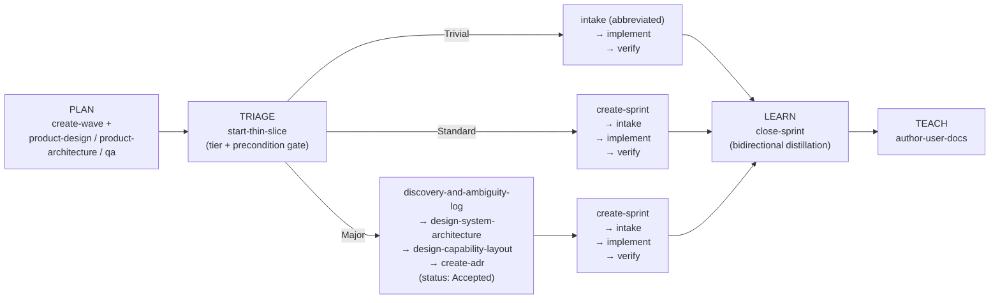

# Skills — Capability Record

The `skills/` tree (20 directories) is the ordered delivery-plus-engineering pipeline that carries a unit of work from intent to shipped, verified, and closed. This record is the current-state truth for that pipeline. The **authoritative ordered path** is `../../../skills/start-thin-slice/SKILL.md` Step 5; the **authoritative tier table** is `../../../skills/intake-code-contribution/SKILL.md` Step 0. Both are generated from `scripts/data/tier-classification.json` via `scripts/gen-tier-table.sh` (see ADR.260720.02, below) — this record points at them rather than re-copying them, so there is exactly one place each fact can drift.

## The pipeline spine

`start-thin-slice` classifies a slice's tier provisionally and enforces a hard precondition gate (dependency + status) before routing. `intake-code-contribution` Step 0 makes the final, authoritative tier call. On the Major path, the architect phase runs *before* `create-sprint`, so the sprint's implementation plan is informed by the Design Package rather than guessing ahead of it.

Two structural entry points sit outside the per-slice spine: `bootstrap-project` scaffolds a brand-new (greenfield) repository with the pipeline already wired in, and `refactor-layered-to-capability` migrates a legacy technical-layer codebase into the pipeline's vertical-slice model one shippable slice at a time.

## Sprint gates

`create-sprint/SKILL.md` hosts both mechanical approval gates a Standard-or-Major slice must clear before implementation starts:

- **Sprint Plan Approval** (Standard & Major) — a human-signed line (`Reviewed by` / `Date` / `Scope confirmed`); `intake-code-contribution` refuses to proceed to implementation while it is blank.
- **Design Approval** (Major only) — requires both an ADR at `status: Accepted` and a signed Design Approval line in the active sprint file. This is the same gate `scripts/check-design-approval-gate.sh` mechanically enforces at `verify` time (see ADR.260720.01, in the `enforcement` capability record) — the sprint file is where the human-signed half of that gate lives; the script is where the machine-checked half lives.

Trivial-tier work carries neither gate: it has no sprint, and routes straight from intake to implementation.

## The `verify-and-assemble-pr` review chain

`verify-and-assemble-pr/SKILL.md` is reviewer mode's entry point and runs 8 top-level steps:

1. **Pyramid Test Strategy** — places each test at the correct layer (Logic → Composition → Adapter Contract → Integration boundary → Journey), per `test-by-ownership`, the cross-cutting Pyramid Test Strategy reference this skill defers to rather than restating.
2. **Coverage that matters** — the leading-indicator scenario list (happy path, boundary, validation/authorization failure, dependency timeout/error, retry, idempotency, concurrency) in place of a lagging coverage percentage.
3. **Run the verification** — the project's single `verify` entry point, a fixed 19-item sequence that aborts on first failure: format, lint, type check, anti-dumping, no-skipped-tests, no-sleep-waits, Port/Adapter parity, seam-contract parity, config-externalization, observability-at-seams, stateless-request-path, resilient-boundary, the **Design Approval gate** (item 13 — hard-fail, no opt-out), then Logic, Composition, Adapter Contract, Seam Behavior, Integration boundary, and Journey tests. A bare checkbox with no captured output is rejected.
4. **Refactor decision matrix** — the only allowed route for escalating a refactor opportunity into PR scope; everything else defaults to a follow-up.
5. **Adversarial seam-behavior review** — a separate head demands, for every touched seam, the specific test proving resilience, idempotency, observability, and concurrency properties — not the presence of a bug, the absence of the proof.
6. **Artifact-fidelity review** — a separate head renders **Substantive / Likely hollow / N/A (tier)** against each artifact the slice actually produced (ADR alternatives, Design Approval signature, ambiguity log, hypothesis card, risk register), quoting the passage that grounds the verdict. A warn-signal for human judgment, not a hard gate (see ADR.260720.03, below).
7. **PR narrative** — Summary, Capability and ADR, Architectural changes, Behavior, Verification, Refactor decision matrix, Adversarial seam review, Fidelity Review, Trust Receipt, Telemetry, Risk and rollback, Out of scope, Follow-ups. The Trust Receipt aggregates gate-kind status (script-enforced / human-signed / agent-attested), escape-hatch usage sourced from `scripts/check-escape-hatch-usage.sh`, and Step 6's verdicts into one block a human reads once instead of re-deriving.
8. **Final self-correction** — a last pass over the diff for dead comments, TODOs, unused imports, and naming drift.

## ADR index

| ADR | Purpose |
| --- | --- |
| [ADR.260720.02: Single-source-of-truth generated tier-classification table](../adr/ADR.260720.02-generated-tier-table.md) | The tier facts render from `scripts/data/tier-classification.json` into `intake-code-contribution` Step 0, `start-thin-slice` Step 5, and `agents/principal-engineer.agent.md`, so the same fact restated three ways cannot silently diverge. |
| [ADR.260720.03: Artifact-fidelity review and the Trust Receipt](../adr/ADR.260720.03-fidelity-review-and-trust-receipt.md) | Adds `verify-and-assemble-pr` Step 6 (fidelity review) and Step 7's Trust Receipt section, closing the gap shape-checking probes cannot: whether an artifact's reasoning has substance. |

**Cross-capability note.** [ADR.260720.01](../adr/ADR.260720.01-design-approval-git-hook-gate.md) (Design Approval git-hook gate) is homed in the `enforcement` capability record but also touches this capability's doctrine: its Design Approval gate is invoked from this pipeline's Major path and enforced against the sprint file this capability's `create-sprint` skill produces.
