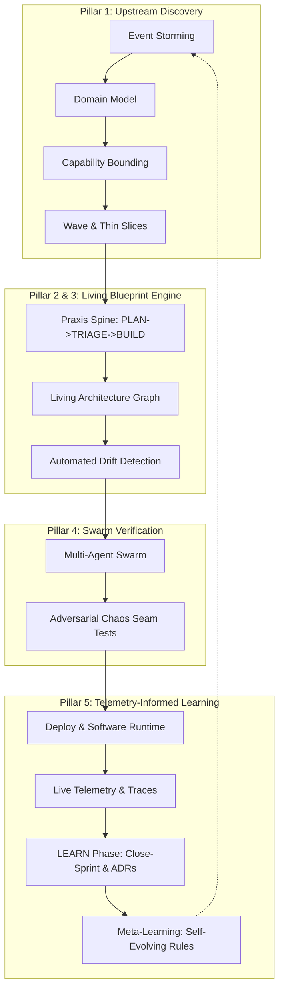

# RFC 260725: SDLC Observation Correlation & Exponential Vision for Praxis

**Date:** 2026-07-25  
**Status:** Proposed  
**Author:** GitHub Copilot  
**Related Documents:**
- [RFC.260725-SDLC-Observation.md](RFC.260725-SDLC-Observation.md)
- [../project-context.md](../project-context.md)
- [README.md](README.md)
- [../architecture/README.md](../architecture/README.md)

---

## Executive Summary

Software development across industry practice alternates between high-level intent definition and low-level code implementation. [RFC.260725-SDLC-Observation.md](RFC.260725-SDLC-Observation.md) captures this reality across four observed workflows: **Business Process Requirements**, **Agile Blueprint**, **System Development**, and **Software Runtime**.

This RFC correlates those observed workflows against the governing doctrine of Praxis in [../project-context.md](../project-context.md). It demonstrates that Praxis currently provides an industry-leading execution engine for the **Agile Blueprint** loop (`PLAN -> TRIAGE -> BUILD -> LEARN -> TEACH`) and **System Development** discipline. However, it also uncovers three strategic gaps:
1. **Upstream Gap:** Lack of formal domain-mapping skills (e.g., Event Storming to Capability boundaries) prior to wave creation.
2. **Incomplete Workflow Articulation:** Section 3 (**System Development**) of the observation RFC remained unarticulated (`...`).
3. **Downstream Gap:** Pre-commit/static bias that stops at build/verify, omitting runtime telemetry feedback into the `LEARN` loop.

To achieve exponential growth in value and skill, Praxis must evolve from a **disciplined pre-commit AI coding method** into an **end-to-end, telemetry-grounded, self-maturing SDLC engine**. This RFC details that future vision across five strategic pillars and provides a concrete roadmap for implementation.

---

## Part I: Systematic Correlation Matrix

The table below maps the four observed SDLC workflows from [RFC.260725-SDLC-Observation.md](RFC.260725-SDLC-Observation.md) directly to Praxis doctrine in [../project-context.md](../project-context.md).

| Observed SDLC Workflow | Praxis Core Analogue | Degree of Alignment | Key Strengths in Praxis Today | Uncovered Gaps & Opportunities |
|---|---|---|---|---|
| **1. Business Process Requirements** (Event Storming, Thin Slices, Notional Architecture, NFRs) | `PLAN` phase (`create-wave`, `create-product-design-spec`, `create-product-architecture-spec`, `create-quality-spec`) | **Moderate to High** | - Waves represent product intent.<br>- Notional Architecture is explicitly modeled as "Educated Theory" in wave `product-architecture.md`.<br>- NFRs are anchored in 4 Production Readiness domains (Configurable, Observable, Scalable, Resilient). | - No formal `skills/event-storming` or domain event mapping skill upstream.<br>- Capability boundary extraction from business domain maps relies on human pre-work. |
| **2. Agile Blueprint** (Micro-artifacts maturing UX, Architecture, ADRs, Code, Living Docs & User Guides) | The Praxis Spine (`PLAN -> TRIAGE -> BUILD -> LEARN -> TEACH`) | **Very High (Core Identity)** | - `close-sprint` acts as the bidirectional distillation pump promoting educated theory into living capability records.<br>- `TEACH` phase ([author-user-docs](../../skills/author-user-docs/SKILL.md)) renders validated capability records into Diátaxis user guides. | - Maturity tracking across multiple waves is implicit rather than measured as a system-level metric.<br>- Freshness between code and user guides relies on soft gates rather than AST diffs. |
| **3. System Development** (Unarticulated `...` in observation RFC) | Principal Engineer Discipline & `BUILD` phase ([implement-with-defensive-patterns](../../skills/implement-with-defensive-patterns/SKILL.md)) | **High (Unformalized in RFC)** | - Capability-driven layout (anti-dumping, vertical slices).<br>- Functional Core / Imperative Shell.<br>- Seam Contracts (`define-seam-contract`).<br>- 3-mode persona bias firewall (Architect, Implementer, Reviewer). | - The observation RFC left this section unarticulated; Praxis can provide the authoritative specification for it.<br>- Lacks automated AST-level seam generation and automated refactoring pipelines. |
| **4. Software Runtime** (Platform Development, Deployment, Monitoring, Maintenance) | 4 Production Readiness Anchors & Pre-Commit Probes (`check-*.sh`) | **Low to Moderate** | - Static verification of externalized config, seam observability, stateless request paths, and resilient boundary rules before push. | - Praxis is currently pre-commit and pre-push only.<br>- Does not ingest live telemetry, APM traces, or error budgets back into the `LEARN` phase. |

---

## Part II: Completing Section 3 — System Development

[RFC.260725-SDLC-Observation.md](RFC.260725-SDLC-Observation.md) left Section 3 incomplete as `3. **System Development**: ...`. We complete this definition by articulating it through the lens of Praxis Principal Engineer discipline.

### 3. System Development Workflow Definition

System Development is the translation of micro-artifacts and thin-slices into resilient, maintainable, and verifiable source code. It governs the structural organization of software, interface boundaries, and defensive execution mechanics.

Key activities include:
- **Capability-Driven Structural Organization:** Code is structured strictly in vertical capability slices that own their logic, persistence, and external adapters. Technical layering silos (`controllers/`, `services/`, `utils/`) are prohibited. Cross-capability dependencies are explicitly gated through public interfaces.
- **Functional Core & Imperative Shell Isolation:** Pure domain logic is strictly isolated from side effects, I/O, and external infrastructure. Pure logic forms the base of the test pyramid, maximizing execution speed and determinism.
- **Seam Contract Freezing:** Interface boundaries between capabilities or external services are formalized as machine-readable Shapes, paired with Behavior test suites, and assigned immutable contract IDs (`<name>@vN`). Dependent slices build against frozen promises rather than waiting for producer merges.
- **Pyramid Test-by-Ownership Strategy:** Testing is structured strictly by ownership tier: **Logic → Composition → Adapter Contract → Integration Boundary → Journey**. Every test asserts exactly one property of a behavior at one layer.
- **Tri-Mode Persona Bias Firewall:** System development mandates strict separation between **Architect mode** (cannot edit source), **Implementer mode** (cannot modify approved design specs or ADRs), and **Reviewer mode** (read-only on source, issues structured change requests).

---

## Part III: The Exponential Future Vision for Praxis

To transform Praxis from a pre-commit agent discipline framework into an **exponentially valuable, end-to-end SDLC power engine**, Praxis must evolve along five strategic pillars.



### Pillar 1: Upstream Strategic Domain Mapping (Event-Storming to Capability Synthesis)
- **Concept:** Extend Praxis upstream before wave creation. Introduce `skills/event-storming` and `skills/derive-domain-capabilities`.
- **Value:** Agents collaborate with domain experts to run virtual Event Storming workshops, generating Domain Events, Commands, Aggregates, and Bounded Contexts.
- **Skill Mechanism:** Automatically output initial capability folder layouts, candidate Seam Contracts, and prioritized Thin Slices (`TS-NNN`) directly into wave documents.

### Pillar 2: Closed-Loop Telemetry-Informed Learning (Runtime -> LEARN Loop)
- **Concept:** Connect Software Runtime telemetry directly back into the `LEARN` step of the spine.
- **Value:** Currently, `close-sprint` relies on agent attestation and captured build/test output. By adding `skills/ingest-runtime-telemetry`, Praxis ingests OpenTelemetry traces, APM metrics, and production error logs post-deployment.
- **Skill Mechanism:** Compare actual production latency, error rates, and circuit breaker activations against the 4 Production Readiness Anchors (Configurable, Observable, Scalable, Resilient). Automatically trigger an ADR proposal or a remediation thin-slice when runtime behavior violates declared SLOs.

### Pillar 3: Living Blueprint Graph & Automated Architecture Drift Engine
- **Concept:** Replace static text files and regex probes with an active, AST-parsed **Living Architecture Graph** (LAG).
- **Value:** Real-time visibility into capability coupling, undeclared imports, broken seam contract versions, and stale capability records.
- **Skill Mechanism:** Continuous background analysis parses source ASTs and `.seam-contracts.json`. When code drifts from declared architecture or capability records, Praxis generates an automated AST refactoring plan via [refactor-layered-to-capability](../../skills/refactor-layered-to-capability/SKILL.md) to realign implementation with truth.

### Pillar 4: Adversarial Multi-Agent Swarm & Seam Chaos Verification
- **Concept:** Elevate the 3-mode persona firewall (Architect, Implementer, Reviewer) into autonomous, contract-bound subagent swarms.
- **Value:** Eliminate self-congratulatory agent verification where the builder checks their own work.
- **Skill Mechanism:** Introduce **Adversarial Seam Chaos Testing** in Reviewer mode. Before PR assembly, the Reviewer agent dynamically synthesizes property-based edge-case inputs, latency injections, and network partition mocks targeting frozen seam contracts. Work is approved only when defensive patterns withstand adversarial probes.

### Pillar 5: Self-Evolving Methodology (Meta-Learning Engine)
- **Concept:** Enable Praxis to learn from its own project execution history.
- **Value:** Every project has unique failure modes, anti-patterns, and escape-hatch usages (`praxis:allow-*`).
- **Skill Mechanism:** Ingest sprint post-mortems, PR review rejections, and escape-hatch logs during `close-sprint`. Automatically propose updates to project-specific instructions (`.instructions.md`) and project context, ensuring the method becomes smarter with every closed sprint.

---

## Part IV: Concrete Capability & Skill Expansion Roadmap

To realize this vision without violating the core principle that ceremony must remain proportional to risk, we propose a four-phase expansion roadmap:

```
Phase 1: Domain Mapping (Upstream) ──► Phase 2: Runtime Telemetry (Downstream)
                 │                                   │
                 ▼                                   ▼
Phase 3: Living Blueprint Graph   ──► Phase 4: Self-Evolving Engine
```

### Phase 1: Upstream Domain & Capability Discovery
1. Create `skills/event-storming`: Interactive domain event discovery and bounded context identification.
2. Create `skills/derive-domain-capabilities`: Converts event storming outputs into capability layouts and initial wave specifications.

### Phase 2: Downstream Runtime Telemetry Ingestion
1. Create `skills/ingest-runtime-telemetry`: Ingests OpenTelemetry/Prometheus/Log metrics into the `LEARN` phase.
2. Create `check-slo-drift.sh` (telemetry probe): Compares ingested runtime telemetry against declared wave SLOs and 4-anchor posture.

### Phase 3: Living Architecture Graph & AST Analysis
1. Create AST-based dependency graph analyzer for seam validation and capability boundary checking.
2. Upgrade [scripts/check-anti-dumping.sh](../../scripts/check-anti-dumping.sh) from heuristic regex searching to semantic AST import analysis.

### Phase 4: Self-Evolving Meta-Learning Loop
1. Extend [skills/close-sprint/SKILL.md](../../skills/close-sprint/SKILL.md) to analyze escape hatches and PR rejection logs.
2. Automatically generate project-level `.instructions.md` rules when recurring anti-patterns are detected across 3+ sprints.

---

## Conclusion

By correlating [RFC.260725-SDLC-Observation.md](RFC.260725-SDLC-Observation.md) against [../project-context.md](../project-context.md), we have defined the missing **System Development** workflow and identified the key frontiers for Praxis. Expanding Praxis upstream into **Domain Event Storming**, downstream into **Telemetry-Informed Learning**, and internally into a **Living Architecture Graph** will exponentially increase its value—enabling AI coding agents to deliver software with unassailable discipline, true trust transfer, and continuous runtime validation.
