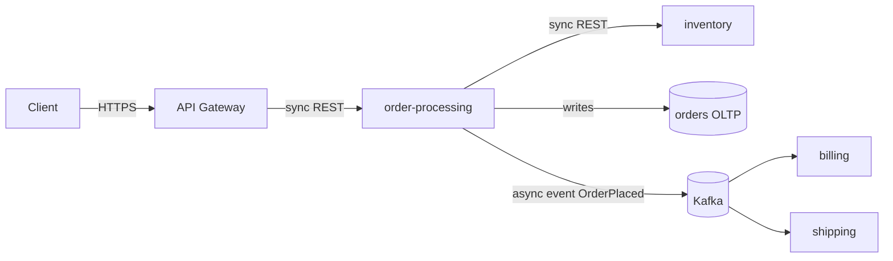

# Worked Example — `order-processing` capability

A complete end-to-end walkthrough of all six phases applied to a small but realistic capability. Use this to see the framework in motion before applying it to your own work.

The example uses generic TypeScript-flavored pseudocode. Translate file extensions and idioms to your stack — the structure is what matters.

---

## Scenario

A small e-commerce backend needs to accept an order, calculate tax based on the buyer's region, persist it, and emit an `OrderPlaced` event so billing and shipping can react asynchronously.

---

## Phase 1 — Discovery (`discovery-and-ambiguity-log`)

### Context map

- **Target capability:** `order-processing` (new)
- **Adjacent capabilities:** `billing` (consumes `OrderPlaced`), `shipping` (consumes `OrderPlaced`), `inventory` (sync check at placement)
- **External dependencies:** Postgres (orders OLTP), Kafka (events), inventory service (sync REST)
- **Runtime:** modular monolith, single deployable, scaled horizontally behind an L7 LB

### SLO / SLA

| Dimension    | Target                                             |
| ------------ | -------------------------------------------------- |
| Throughput   | 50 RPS sustained, 200 RPS burst                    |
| Latency      | p95 ≤ 250 ms, p99 ≤ 500 ms                         |
| Availability | 99.9 % monthly                                     |
| Consistency  | Strong on write; eventual for downstream consumers |
| Durability   | Zero loss; replicate before ack                    |

### Ambiguity Log

| # | Question                                                            | Why it matters                                          | Default if unanswered                 |
| - | ------------------------------------------------------------------- | ------------------------------------------------------- | ------------------------------------- |
| 1 | Can a buyer retry the same `POST /orders` safely?                   | Determines idempotency-key requirement                  | Assume yes; require `Idempotency-Key` |
| 2 | Is inventory check authoritative at placement, or best-effort?      | Determines sync vs. async to `inventory`                | Assume authoritative; sync REST       |
| 3 | Is tax recalculated downstream by `billing`, or fixed at placement? | Determines whether tax is part of `OrderPlaced` payload | Assume fixed at placement             |

> **Stop.** Resolved by product owner: (1) yes-idempotent, (2) authoritative, (3) fixed.

---

## Phase 2/3 — System Architecture + Data & API (`design-system-architecture`)

### Topology



### Sync vs. async decisions

| Edge                       | Choice      | Why                                                                       |
| -------------------------- | ----------- | ------------------------------------------------------------------------- |
| client → api → orders      | sync REST   | Caller needs the order ID and tax back                                    |
| orders → inventory         | sync REST   | Authoritative reservation required before ack                             |
| orders → billing, shipping | async event | Decoupled lifecycles; either consumer can be down without blocking orders |

### Resilience

| Mechanism       | Where                               | Value                                                                             |
| --------------- | ----------------------------------- | --------------------------------------------------------------------------------- |
| Timeout         | inventory call                      | 500 ms                                                                            |
| Retry           | inventory call (idempotent reserve) | 2 attempts, 50 ms base, jittered                                                  |
| Circuit breaker | inventory call                      | open at 50 % errors over 30 s for 60 s                                            |
| Rate limiter    | API edge                            | 100 RPS per token, 1000 RPS global                                                |
| Backpressure    | Kafka producer                      | bounded in-memory queue (depth 1000), block-with-timeout enqueue, metric on drops |
| Idempotency key | `POST /orders`                      | `Idempotency-Key` header, 24h dedup window                                        |

### Contract — `POST /orders` (OpenAPI excerpt)

```yaml
post:
  operationId: placeOrder
  parameters:
    - in: header
      name: Idempotency-Key
      required: true
      schema: { type: string, format: uuid }
    - in: header
      name: traceparent
      required: false
      schema: { type: string }
  requestBody:
    required: true
    content:
      application/json:
        schema:
          type: object
          required: [items, shippingZip]
          properties:
            items:
              type: array
              items:
                type: object
                required: [sku, qty]
                properties:
                  sku: { type: string }
                  qty: { type: integer, minimum: 1 }
            shippingZip: { type: string }
  responses:
    "201":
      content:
        application/json:
          schema:
            type: object
            required: [orderId, totalCents, taxCents, correlationId]
    "400":
      $ref: "#/components/responses/ErrorEnvelope"
    "409":
      $ref: "#/components/responses/ErrorEnvelope"
```

### Event — `OrderPlaced` (JSON Schema)

```json
{
  "type": "object",
  "required": [
    "orderId",
    "buyerId",
    "items",
    "totalCents",
    "taxCents",
    "placedAt",
    "correlationId"
  ],
  "properties": {
    "orderId": { "type": "string", "format": "uuid" },
    "buyerId": { "type": "string", "format": "uuid" },
    "items": { "type": "array" },
    "totalCents": { "type": "integer" },
    "taxCents": { "type": "integer" },
    "placedAt": { "type": "string", "format": "date-time" },
    "correlationId": { "type": "string" }
  }
}
```

Topic: `orders.placed.v1` — partition key: `buyerId` — ordering guarantee: per buyer.

### Storage

| Capability         | Engine          | Reason                                            |
| ------------------ | --------------- | ------------------------------------------------- |
| `order-processing` | Postgres (OLTP) | ACID, joins for line items, mature backup tooling |

### Schema evolution

Initial schema — no migration needed yet. Future tax-rule changes will follow expand → backfill → switch reads → switch writes → contract.

---

## Phase 4 — Component Layout (`design-capability-layout`)

### Folder layout

```
src/
└── order-processing/
    ├── order-processing.entity.ts                       # core — types, schemas
    ├── order-processing.ports.ts                        # core — OrderRepository, InventoryPort, EventBus interfaces
    ├── order-processing.service.ts                      # core — placeOrder, calculateTax
    ├── order-processing.repository.ts                   # shell — Postgres adapter for OrderRepository
    ├── order-processing.inventory.adapter.ts            # shell — real REST adapter for InventoryPort
    ├── order-processing.events.ts                       # shell — Kafka adapter for EventBus
    ├── order-processing.adapter-memory.ts               # shell (test-only) — in-memory adapters for all 3 ports
    ├── order-processing.api.ts                          # shell — HTTP handler
    ├── order-processing.order-repository.contract.test.ts  # shared contract — runs against both Postgres + in-memory
    ├── order-processing.inventory-port.contract.test.ts    # shared contract — runs against both sandbox + in-memory
    ├── order-processing.test.ts                         # logic + composition tests
    └── mod.ts                                           # public surface
```

**Forbidden in this layout:** no `controllers/`, `services/`, `models/`, `utils/`, `helpers/`, `common/`, `shared/`, sub-`services/` inside the capability.

### Core / shell mapping

| File                     | Layer             | Notes                                                                                           |
| ------------------------ | ----------------- | ----------------------------------------------------------------------------------------------- |
| `*.entity.ts`            | Core              | Pure types and Zod schemas                                                                      |
| `*.ports.ts`             | Core              | `OrderRepository`, `InventoryPort`, `EventBus` interfaces. The capability owns these contracts. |
| `*.service.ts`           | Core              | `placeOrder(deps, input)`, `calculateTax(order, region)` — pure given injected Port deps        |
| `*.repository.ts`        | Shell             | Real Postgres adapter implementing `OrderRepository`. SQL only, no business decisions.          |
| `*.inventory.adapter.ts` | Shell             | Real REST adapter implementing `InventoryPort`                                                  |
| `*.events.ts`            | Shell             | Real Kafka adapter implementing `EventBus`                                                      |
| `*.adapter-memory.ts`    | Shell (test-only) | In-memory implementations of all 3 Ports. Real code, not stubs. Never imported by production.   |
| `*.api.ts`               | Shell             | HTTP parse → call service → format response                                                     |

**Port/Adapter parity:** every Port has both a real adapter and an in-memory adapter, and both pass the shared contract suite. CI fails otherwise.

### Public surface — `mod.ts`

```ts
export type {
  Order,
  OrderItem,
  OrderPlacedEvent,
} from "./order-processing.entity";
export { createOrderService } from "./order-processing.service";
// Nothing else. Repository, events producer, and API stay private.
```

### Cross-capability dependencies

| Caller             | Callee             | Method                    | Rationale                              |
| ------------------ | ------------------ | ------------------------- | -------------------------------------- |
| `order-processing` | `inventory`        | sync REST `reserve()`     | Authoritative consistency at placement |
| `billing`          | `order-processing` | async event `OrderPlaced` | Loose coupling                         |
| `shipping`         | `order-processing` | async event `OrderPlaced` | Loose coupling                         |

### ADR (excerpt)

```markdown
# ADR.260527: Introduce `order-processing` capability

## Status

Accepted

## Decision

Create `order-processing` as a vertical-slice capability containing entity, service (functional core), repository (shell), HTTP API (shell), and event producer (shell). Public surface is `mod.ts`. Persistence is Postgres OLTP. Downstream notification is via `OrderPlaced` event on `orders.placed.v1`.

## Alternatives considered

| Option                            | Pros                                           | Cons                                         | Verdict  |
| --------------------------------- | ---------------------------------------------- | -------------------------------------------- | -------- |
| Capability-driven slice (chosen)  | Aligns with anti-dumping policy; testable core | Slightly more files                          | Selected |
| Add to existing `services/` layer | Familiar to legacy contributors                | Re-introduces forbidden technical-layer silo | Rejected |
| Microservice from day one         | Independent scaling                            | Premature; org has one team                  | Rejected |

## Consequences

-
  - Future capabilities follow the same shape.
- − Existing legacy `services/` callers need to route through `mod.ts`.
- Risk: ordering guarantee depends on Kafka partition by `buyerId`.
```

> **Stop.** Approved by tech lead.

---

## Phase 5 — Implementation (`implement-with-defensive-patterns`)

### TDD — write the failing test first

```ts
// order-processing.test.ts
import { describe, expect, it } from "vitest";
import { calculateTax } from "./order-processing.service";

describe("calculateTax (functional core)", () => {
  it("applies regional rate to subtotal", () => {
    const order = { items: [{ sku: "A", qty: 2, unitCents: 500 }] };
    const region = { code: "US-CA", taxBps: 875 }; // 8.75 %
    expect(calculateTax(order, region)).toEqual({ taxCents: 88 });
  });

  it("returns zero tax for tax-exempt region", () => {
    const order = { items: [{ sku: "A", qty: 1, unitCents: 1000 }] };
    const region = { code: "US-OR", taxBps: 0 };
    expect(calculateTax(order, region)).toEqual({ taxCents: 0 });
  });

  it("rejects negative quantities", () => {
    const order = { items: [{ sku: "A", qty: -1, unitCents: 500 }] };
    const region = { code: "US-CA", taxBps: 875 };
    expect(() => calculateTax(order, region)).toThrow(/quantity/i);
  });
});
```

> **RED.** Now write the minimum code to make these pass.

### Core — `order-processing.service.ts`

```ts
import type { Order, Region, TaxResult } from "./order-processing.entity";

export function calculateTax(order: Order, region: Region): TaxResult {
  for (const item of order.items) {
    if (item.qty < 1) throw new Error("quantity must be >= 1");
  }
  const subtotal = order.items.reduce((s, i) => s + i.qty * i.unitCents, 0);
  const taxCents = Math.round((subtotal * region.taxBps) / 10_000);
  return { taxCents };
}

export function createOrderService(deps: {
  orderRepo: OrderRepository;
  inventoryPort: InventoryPort;
  eventBus: EventBus;
  clock: () => Date;
  logger: Logger;
  metrics: Metrics;
}) {
  return {
    async placeOrder(
      input: PlaceOrderInput,
      idempotencyKey: string,
      correlationId: string,
    ) {
      const start = performance.now();
      try {
        const existing = await deps.orderRepo.findByIdempotencyKey(
          idempotencyKey,
        );
        if (existing) return existing; // shift-left idempotency

        const region = await deps.inventoryPort.regionFor(input.shippingZip);
        const { taxCents } = calculateTax(input, region); // <-- core
        await deps.inventoryPort.reserve(input.items); // sync, with timeout+retry+CB in the port
        const order = await deps.orderRepo.save({
          ...input,
          taxCents,
          totalCents: subtotalOf(input) + taxCents,
          idempotencyKey,
          placedAt: deps.clock(),
        });
        await deps.eventBus.publish("orders.placed.v1", {
          orderId: order.id,
          buyerId: order.buyerId,
          items: order.items,
          totalCents: order.totalCents,
          taxCents: order.taxCents,
          placedAt: order.placedAt.toISOString(),
          correlationId,
        });

        deps.metrics.histogram(
          "order.place.latency_ms",
          performance.now() - start,
        );
        deps.metrics.counter("order.place.count", 1, { result: "success" });
        deps.logger.info("order placed", { orderId: order.id, correlationId });
        return order;
      } catch (err) {
        deps.metrics.counter("order.place.count", 1, { result: "error" });
        deps.logger.warn("order placement failed", {
          correlationId,
          reason: errorCode(err),
        });
        throw err;
      }
    },
  };
}
```

### Shell — `order-processing.api.ts`

```ts
import { z } from "zod";
const placeOrderSchema = z.object({
  items: z.array(
    z.object({
      sku: z.string(),
      qty: z.number().int().min(1),
      unitCents: z.number().int().min(0),
    }),
  ).min(1),
  shippingZip: z.string().regex(/^[0-9]{5}$/),
});

export function placeOrderHandler(svc: OrderService) {
  return async (req: Request): Promise<Response> => {
    const correlationId = req.headers.get("traceparent") ?? crypto.randomUUID();
    const idempotencyKey = req.headers.get("Idempotency-Key");
    if (!idempotencyKey) {
      return errorResponse(400, "IDEMPOTENCY_KEY_REQUIRED", correlationId);
    }

    const parsed = placeOrderSchema.safeParse(await req.json());
    if (!parsed.success) {
      return errorResponse(400, "INVALID_PAYLOAD", correlationId);
    }

    try {
      const order = await svc.placeOrder(
        parsed.data,
        idempotencyKey,
        correlationId,
      );
      return new Response(
        JSON.stringify({
          orderId: order.id,
          totalCents: order.totalCents,
          taxCents: order.taxCents,
          correlationId,
        }),
        { status: 201 },
      );
    } catch (err) {
      if (err instanceof InventoryUnavailable) {
        return errorResponse(409, "INVENTORY_UNAVAILABLE", correlationId);
      }
      return errorResponse(500, "INTERNAL", correlationId);
    }
  };
}
```

### Shift-left security checks applied

- ✅ Schema validation at the boundary (Zod).
- ✅ Parameterized queries in repository (no string concat).
- ✅ `Idempotency-Key` required for the mutating endpoint.
- ✅ Uniform error envelope with correlation ID.
- ✅ No PII / secrets in logs — only IDs and reason codes.

### Defensive external calls

The `inventoryPort.reserve` implementation wraps the call:

```ts
await withTimeout(
  withCircuitBreaker(
    withRetry(() => inventoryClient.reserve(items), {
      attempts: 2,
      baseMs: 50,
      jitter: true,
    }),
    { errorThreshold: 0.5, windowMs: 30_000, openMs: 60_000 },
  ),
  { ms: 500 },
);
```

---

## Phase 6 — Verification (`verify-and-assemble-pr`)

### Pyramid Test Strategy applied (test-by-ownership)

| Pyramid position | Layer                | What it covers here                                                                                                                                                                             | Substitution                                                                                                           |
| ---------------- | -------------------- | ----------------------------------------------------------------------------------------------------------------------------------------------------------------------------------------------- | ---------------------------------------------------------------------------------------------------------------------- |
| Base             | Logic                | `calculateTax` — normal subtotal, tax-exempt region, negative-qty rejection                                                                                                                     | None — pure function                                                                                                   |
| Lower-middle     | Composition          | `placeOrder` orchestrates repo → inventory → event bus in order; idempotency replay returns cached order; error envelopes propagate                                                             | In-memory `OrderRepository`, in-memory `InventoryPort`, in-memory `EventBus` from `order-processing.adapter-memory.ts` |
| Middle           | Adapter Contract     | `order-repository.contract.test.ts` runs against Postgres TestContainer and the in-memory adapter — proves the in-memory adapter doesn't lie about uniqueness, ordering, transactional rollback | Adapter under test is real                                                                                             |
| Upper-middle     | Integration boundary | `inventoryPort.reserve` wrapper — 500 ms timeout, 2 retries with jitter, circuit opens at 50 % errors, idempotent replay                                                                        | `InventoryPort` backend → Pact contract-tested fake (re-validated nightly against inventory sandbox)                   |
| Tip              | Journey              | `POST /orders` against the full app on a test cluster; `OrderPlaced` observed on Kafka by a real `billing` consumer                                                                             | None                                                                                                                   |

**One property of a behavior, at one layer.** `calculateTax` math is asserted only at Logic. SQL uniqueness is asserted only at Adapter Contract. Timeout behavior is asserted only at Integration boundary. The Composition layer asserts orchestration order, not math or SQL.

**Port/Adapter parity gate green:** `OrderRepository` and `InventoryPort` and `EventBus` each have both adapters passing their shared contract suite.

**Environment Blocked example:** the inventory sandbox was down for 30 minutes during the run. The Journey test for `POST /orders` against the sandbox reported `BLOCKED`, not `FAIL`. The Integration boundary tests still ran against the contract-tested Pact fake and passed.

### Quality-gate run

```
✓ format          (0 errors)
✓ lint            (0 warnings)
✓ type check      (strict, 0 errors)
✓ anti-dumping    (no forbidden folders introduced)
✓ logic tests             (12 / 12 pass)
✓ composition             (7 / 7 pass)
✓ adapter contract        (8 / 8 pass — in-memory + Postgres)
✓ integration boundary    (5 / 5 pass)
✓ journey                 (3 pass, 1 BLOCKED — inventory sandbox down)
✓ port/adapter parity     (3 / 3 ports have both adapters green)
```

### PR narrative (excerpt)

```markdown
## Summary

Introduces `order-processing` capability per ADR.260527. Accepts orders with idempotency, calculates tax in a pure functional core, persists to Postgres, and emits `OrderPlaced` on `orders.placed.v1`.

## Capability and ADR

- Capability: `order-processing` (new)
- ADR: ADR.260527

## Verification

- [x] Format, lint, type check, anti-dumping
- [x] Logic (12), Composition (7), Adapter Contract (8 — in-memory + Postgres), Integration boundary (5), Journey (3 pass + 1 BLOCKED with reason)
- [x] Port/Adapter parity gate green (OrderRepository, InventoryPort, EventBus all have both adapters)

## Telemetry

- Logs: `order placed`, `order placement failed` with `{orderId, correlationId, reason}`
- Metrics: `order.place.latency_ms` histogram; `order.place.count` counter by `result`
- Trace span: `order.place` wraps the full handler

## Risk and rollback

- Blast radius: new endpoint only; no existing route touched
- Reversible: yes — disable route in API gateway; drained Kafka consumers stay safe (consumers tolerate absence)
- Monitoring signal: `order.place.count{result="error"}` > 1 % over 5 min
```

---

## What this example demonstrates

- The Ambiguity Log forced three decisions that would otherwise have been guessed during coding.
- Sync vs. async decisions are named per edge, not adopted blindly.
- Every external call declares timeout + retry + circuit breaker.
- The capability folder contains exactly the files for this capability — no `controllers/`, no `utils/`, no `services/` subfolder.
- The core (`calculateTax`) is testable with zero infrastructure.
- The public surface (`mod.ts`) is two exports — repository and events stay private.
- The ADR is one page, not a dissertation.
- The PR description names the rollback procedure, not "revert the commit."

Apply this shape to your own capability and the framework will start to feel like muscle memory.
