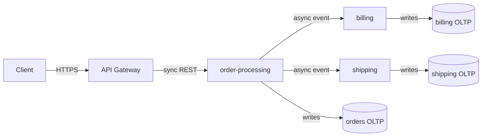

# Design System Architecture

## Use this when

- Phase 1 (`discovery-and-ambiguity-log`) is complete and the Ambiguity Log is resolved.
- About to design a system spanning multiple components, processes, or external integrations.

## Do NOT use this when

- The change is internal to a single capability with no new contract or dependency. Skip to `design-capability-layout`.
- No SLOs are defined yet. Return to Phase 1.

## Steps

### Step 1 — Topology

Produce a Mermaid (or ASCII) diagram showing:

- Component boundaries (which capability owns which box).
- Network paths and call types: `sync REST`, `sync gRPC`, `async event`, `batch`.
- Data stores and their owners (which capability owns which schema).
- Trust boundaries (where input must be validated).

Example:

### Step 2 — Choose call types deliberately

| Use sync (REST/gRPC) when                   | Use async (event/queue) when                            |
| ------------------------------------------- | ------------------------------------------------------- |
| Caller needs the result to continue         | Multiple consumers care about the same fact             |
| Strong consistency required end-to-end      | Caller can proceed without the result                   |
| p99 latency budget is tight and predictable | Producer should not be coupled to consumer availability |
| One downstream                              | Heavy compute or fan-out                                |

State the choice for each edge and name the trade-off.

### Step 3 — Resilience topology

For each external call, declare:

| Mechanism        | Where it goes                                           | Configured value                                                                          |
| ---------------- | ------------------------------------------------------- | ----------------------------------------------------------------------------------------- |
| Timeout          | Every external call                                     | e.g., 2s for DB, 5s for third-party API                                                   |
| Retry            | Idempotent calls only                                   | e.g., 3 attempts, exponential backoff with jitter, cap at 30s                             |
| Circuit breaker  | High-traffic critical paths                             | e.g., 50% error rate over 30s opens for 60s                                               |
| Rate limiter     | Edge of the system                                      | e.g., 100 RPS per token, 1000 RPS global                                                  |
| Load shedder     | At the edge under saturation                            | e.g., 503 with `Retry-After` when CPU > 85%                                               |
| Backpressure     | Bounded queues / channels between producer and consumer | e.g., queue depth cap, blocking-with-timeout enqueue, drop-oldest on overflow with metric |
| Bulkhead         | Isolate slow dependencies                               | e.g., separate connection pool per downstream                                             |
| Idempotency keys | Mutating endpoints                                      | e.g., `Idempotency-Key` header, 24h dedup window                                          |

State which apply and which do not, with reasoning.

### Step 4 — Contract-first API specs

For every interface (HTTP, gRPC, event), produce the contract before any implementation:

- **HTTP** → OpenAPI 3.x snippet.
- **gRPC** → `.proto` snippet.
- **Event** → schema definition (JSON Schema, Avro, Protobuf) plus topic / queue name and ordering guarantee.

Every contract must include:

- Request and response schemas with concrete types.
- Uniform error envelope (status code, machine-readable error code, human message, correlation ID).
- Idempotency key header for mutating operations.
- Distributed trace context propagation (`traceparent`, `tracestate` for HTTP; equivalent for other transports).
- Versioning strategy (URL versioning, header versioning, or schema evolution rules).

### Step 5 — Storage strategy (polyglot persistence)

Match each data set to the right engine:

| Workload                                        | Engine class                               | Pick because                            |
| ----------------------------------------------- | ------------------------------------------ | --------------------------------------- |
| Strong-consistency transactional writes         | OLTP relational (Postgres, MySQL)          | ACID, joins, mature tooling             |
| Single-key ultra-low-latency reads              | KV store (Redis, DynamoDB)                 | O(1) access, horizontal scale           |
| Document-shaped aggregates with flexible schema | Document store (Mongo, Couchbase)          | Schema flexibility, nested reads        |
| Full-text search and ranking                    | Search index (Elasticsearch, OpenSearch)   | Inverted index, scoring                 |
| Wide analytical scans                           | Columnar (ClickHouse, BigQuery, Snowflake) | Compression, vectorized scans           |
| Append-only event log                           | Streaming log (Kafka, Pulsar)              | Replay, fan-out, ordering per partition |
| Graph traversals                                | Graph DB (Neo4j, SurrealDB)                | Native traversal cost model             |

For each capability, name the engine and the reason. Multiple engines per capability is fine when the workloads truly differ.

### Step 6 — Schema evolution / migration plan

For any data change, prefer the **expand / contract** pattern (zero downtime):

1. **Expand** — add new column/field/index alongside the old one. Both readable.
2. **Migrate** — backfill new from old. Dual-write from application.
3. **Switch reads** — point readers at the new field. Keep writes dual.
4. **Switch writes** — write only the new field.
5. **Contract** — drop the old field after a safety window.

State the steps explicitly per change. Name the rollback point at each step.

### Step 7 — Persist to the durable architecture tree

The outputs above are the durable architecture record. **They must not evaporate into chat.** Write them into `docs/architecture/` so the topology and resilience posture survive the session. Three homes, by altitude:

**Whole-system overview** → `docs/architecture/README.md` (living)

- The cross-capability topology diagram — the edges *between* capabilities (no single capability owns an edge, so it lives here).
- The product-wide four-anchor posture (observable, configurable, horizontally scalable, resilient).
- An index of capabilities and system-level ADRs.

**Per-capability record** → `docs/architecture/<capability>/README.md` (living)

- The capability's current-state topology, call types, and resilience table.
- Storage engine + rationale; schema evolution state.
- Contract / seam references (`<name>@vN`).
- An index of the capability's ADRs.
- Write it to be legible to a **docs author** (what the capability does, its concepts) as well as an engineer (how it is built). This record is the source the user-facing docs (how-tos, tutorials, product concepts) are generated from downstream.

**Decisions** → one ADR per durable choice — sync/async boundary, storage engine, resilience strategy, trust boundary — via `create-adr`, each carrying a diagram *as of that decision*.

These are **living** documents. On later waves, edit the overview and capability records **in place** to reflect the current truth; spawn a **superseding** ADR when a durable decision changes. The wave `product-architecture.md` stays the **hypothesis** (the educated theory) and only points into these records — it never duplicates current-state topology (**Wave = educated theory; capability record = truth**).

### Step 8 — Stop

Confirm what was written, in order:

1. Topology diagram → system overview and/or capability record.
2. Sync vs. async decisions with rationale → capability record.
3. Resilience table → capability record; product-wide posture → system overview.
4. Contract specs (one per interface) → capability record + seam manifest.
5. Storage choices with rationale → capability record.
6. Schema evolution plan (if any data change) → capability record.
7. ADRs spawned for durable decisions.

Then say: **"Please review the architecture. Approve before I proceed to Phase 4 (capability layout)."**

Do not write component file structures or code yet.

## Anti-patterns

- Diagrams without trust boundaries marked.
- Sync calls everywhere "for simplicity" — name the latency and coupling cost.
- Missing timeout / retry decisions on any external call.
- API contracts without an error envelope.
- "We'll add tracing later" — design it in now.
- Schema migrations that require downtime when expand/contract is feasible.
- Leaving the topology and resilience table in chat only — if Step 7 didn't write them into `docs/architecture/`, the architecture record evaporates.
